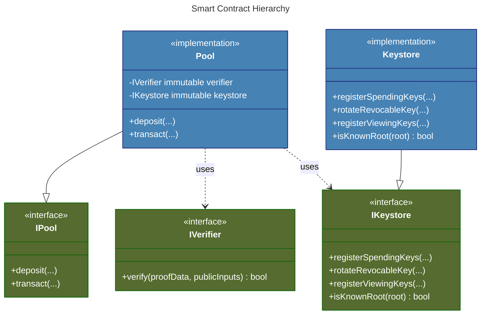
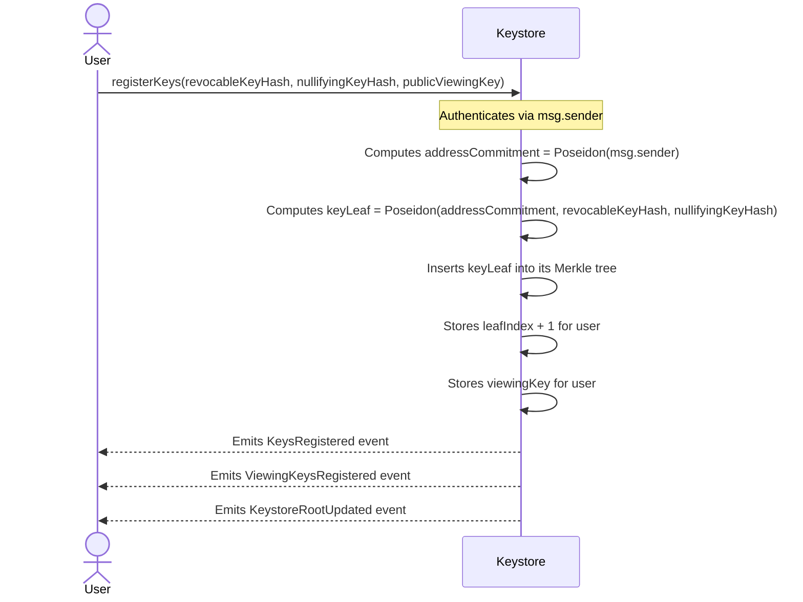
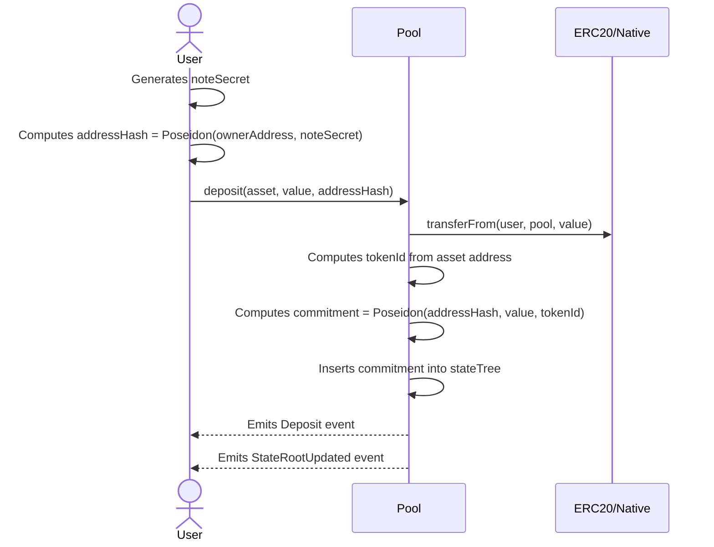
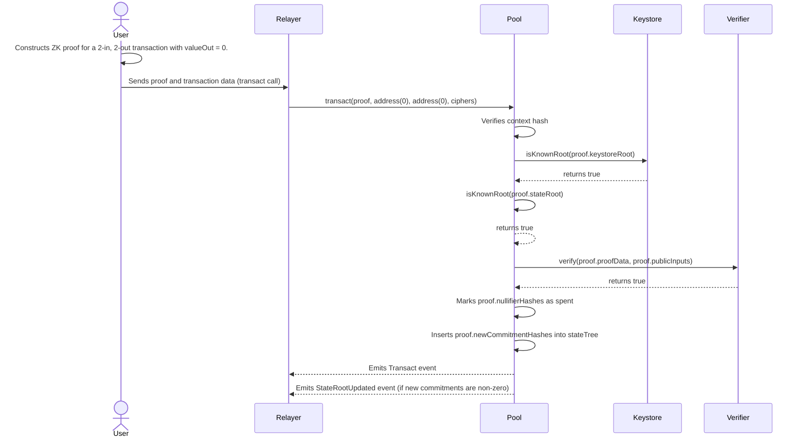
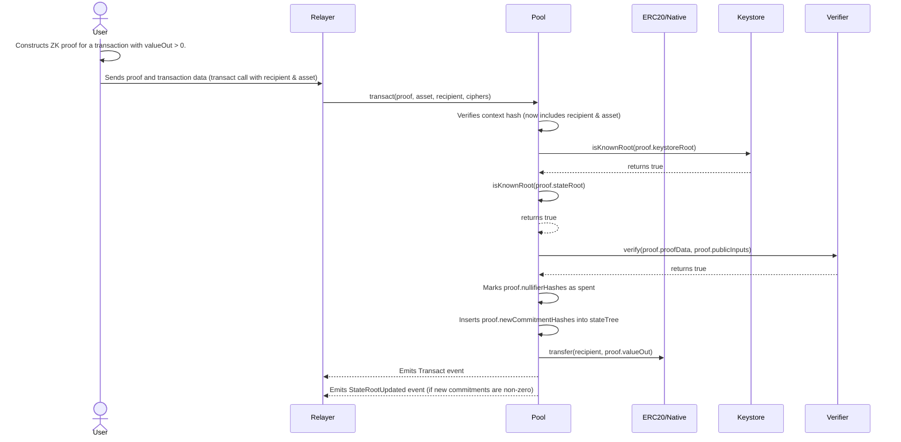

# Contracts

This document details the smart contract architecture, interfaces, and core logic for the Privacy Pools v2 MVP. It is intended for a technical audience and focuses on the system's design, security, and interactions.

## 1. Contract Architecture

The on-chain system is designed with a clear separation of concerns, split between two main contracts: `Pool.sol` and `Keystore.sol`.

- **`Pool.sol` (The Vault):** This contract manages the funds and the privacy set. It holds all deposited assets and maintains the Merkle tree of note commitments. Its primary responsibility is to verify the integrity of transactions (e.g., value conservation, preventing double-spends) but it is agnostic to user identity.
- **`Keystore.sol` (The Gatekeeper):** This contract handles user authorization. It maintains a separate Merkle tree that links a user's public `ownerAddress` to their private spending keys. It answers the question, "Is this user authorized to spend?" but has no knowledge of the notes or assets in the pool.

This two-contract architecture improves modularity. The `Pool` contract relies on the `Keystore` to validate the ownership portion of a ZK proof, but the two systems otherwise operate independently.



## 2. Contract Invariants

These are core properties of the smart contracts that must hold true at all times. They are critical for the system's security and logical correctness.

1. **Conservation of Value:** The total value of a specific asset held in the `Pool.sol` contract's balance must be equal to the sum of the values of all unspent notes of that asset type recorded in its `stateTree`.
2. **Nullifier Uniqueness:** A nullifier, once revealed and marked as spent in the `nullifierHashes` mapping, can never be used again. This is the fundamental defense against double-spending.
3. **Append-Only State:** The `stateTree` (for note commitments) and the `keyRegistry` tree (for user keys) are append-only data structures. Leaves are never removed. For the `keyRegistry`, a leaf can be updated, but only to change the revocable spending key.
4. **Root Validity:** Any `stateRoot` or `keystoreRoot` used in a valid ZK proof submitted to the `transact` function must exist in the recent historical root list of the respective contract. A proof verified against a non-existent root must always be rejected.
5. **Asset Consistency:** This is a system-wide invariant enforced jointly by the circuit and the contract.
    - **Circuit Invariant:** The ZK circuit is responsible for proving that all input notes and all private output notes within a single transaction belong to the same asset `tokenId`. It must also prove that this internal `tokenId` is correctly reflected in the public `tokenIdOut` signal of the proof.
    - **Contract Invariant:** The `Pool` contract is responsible for linking the proof to the public action. When processing a withdrawal, it must verify that the `tokenIdOut` from the proof corresponds to the `_asset` being transferred out. This check ensures that a valid proof for one asset cannot be used to withdraw a different asset.
6. **Proof Context Integrity:** The `context` field within a ZK proof serves as a cryptographic commitment to the transaction's public, non-proof arguments (e.g., withdrawal recipient, asset, and encrypted ciphers). The contract must re-calculate this commitment using the arguments provided in the `transact` call and verify that it matches the `context` value from the proof. This ensures that a valid proof cannot be maliciously replayed with different parameters.

## 3. Flows

### 3.1. User Registers Spending Keys

A new user must register their keys once to be able to spend notes. This is a public transaction from their `ownerAddress`.



### 3.2. User Deposits Assets

A user deposits assets to create a private note.

The `deposit` function serves a dual purpose. While its primary role is to allow a user to shield their own assets, it also enables a simple form of private transfer. The protocol intentionally decouples the transaction's initiator (`msg.sender`) from the note's cryptographic owner (the `ownerAddress` hashed into the `addressHash`). This means one user can call `deposit` to create a note directly owned by another user. The public `Deposit` event links the transaction to the depositor, but the actual recipient of the private funds remains concealed within the commitment. The depositor is then responsible for securely transmitting the note's secrets to the owner off-chain.



### 3.3. User Makes a Private Transfer (via Relayer)

A user spends an existing note to create a new one for a recipient.



### 3.4. User Makes a Private Transfer with Public Withdrawal (via Relayer)

This flow shows a user spending notes and also withdrawing some value to a public address in the same transaction.



## 4. Key Design Choices & Heuristics

### 4.1. Decoupled `Keystore` vs. Monolithic Design

A core architectural shift from the legacy Privacy Pools version is the separation of key management into a dedicated `Keystore.sol` contract.

- **Legacy Model:** In the previous version, key management was handled entirely off-chain. The client-side code (`account.service.ts`) would deterministically generate a user's secrets and nullifiers from a single master seed phrase. This required a user to set up a wallet and back up a seed *before* they could receive funds, creating significant onboarding friction.
- **MVP Model:** This version introduces an on-chain `Keystore` that creates a public, verifiable link between a user's everyday `ownerAddress` and their private spending keys. This solves the "cold start" problem by allowing anyone to create a note for any `ownerAddress`, with the recipient only needing to perform a one-time `registerKeys` transaction to authorize themselves to spend it later. It separates the act of receiving from the act of spending authorization.
    - **Note on Client-Side Key Generation:** This on-chain model is complemented by a client-side, deterministic secret generation protocol. The UI will guide the user through a signature-based process that derives all necessary private keys (`privateNullifyingKey`, `privateRevocableKey`) from their wallet's master seed. This eliminates the need for users to store or back up a separate mnemonic for Privacy Pools, significantly improving usability and security.

### 4.2. Multi-Purpose `transact` Function

This MVP introduces a single, multi-purpose `transact` function to handle all private operations, a notable change from the separate `withdraw` function in the legacy contract.

- **Legacy Model:** The original contract was designed primarily for a deposit-and-withdraw flow, providing a one-way shield for assets. It lacked a dedicated function for efficient, private peer-to-peer transfers within the pool. Simulating a transfer required a user to publicly withdraw funds, which the recipient would then need to deposit in a separate transaction, creating an inefficient and observable two-step process.
- **MVP Model:** The `transact` function is designed to be multi-purpose. By verifying a single ZK proof, a user can spend up to two input notes and generate up to two new output notes. The same operation can optionally include a public withdrawal by providing a non-zero `valueOut` in the proof. This unified function improves user experience and privacy. By handling all private operations through a single entry point, it standardizes the on-chain footprint, making it more difficult to differentiate between a pure private transfer and a transfer that includes a partial withdrawal based on contract interaction patterns alone.

### 4.3. Multiple Verifiers for Circuit Flexibility

The protocol uses a templated ZK circuit design that is instantiated into two distinct, specialized circuits: one for 1-input-2-output transactions and another for 2-input-2-output transactions. This was chosen over a single, universal circuit that would handle 1-input cases with complex and inefficient "dummy note" logic.

To support this, the `Pool.sol` contract is designed to work with two verifier contracts.

- **Implementation:** The `Pool` contract stores the addresses of two verifiers, provided in its constructor. It has a single, unified `transact` function. When a proof is submitted, this function inspects the length of the proof's `publicSignals` array to determine which circuit it was generated from (1-input proofs have a shorter signal array than 2-input proofs). It then dispatches the verification call to the corresponding verifier.
- **Rationale:** This approach provides the best of both worlds.
    - **On-Chain Efficiency:** It allows for highly optimized circuits that reduce proof generation time and transaction costs for the common 1-input case.
    - **User Experience:** It maintains a single, simple `transact` entry point in the contract, hiding the underlying complexity from users and client-side developers. They simply submit a valid proof, and the contract handles the routing internally.

## 5. Interfaces and Data Structures

### 5.1. `IKeystore.sol`

This interface defines the contract responsible for managing user keys. Its primary purpose is to solve the "cold start" problem by creating an on-chain, public registry that links a user's standard `ownerAddress` to their private spending keys. This allows notes to be sent to any Ethereum address, even if the recipient has not yet interacted with the protocol.

```solidity
// SPDX-License-Identifier: MIT
pragma solidity 0.8.23;

/**
 * @title Keystore Interface
 * @notice Manages user key registration and rotation for the Privacy Pool protocol.
 * @dev This contract maintains a Merkle tree of user key commitments, allowing the main Pool
 * contract to verify ownership proofs for spending actions.
 */
interface IKeystore {
    uint32 constant ROOT_HISTORY_SIZE = 64;

    error UserAlreadyRegistered();
    error UserNotRegistered();
    error InvalidKeyCommitment();
    error IdenticalKeyCommitments();
    error MaxTreeDepthReached();

    event KeystoreRootUpdated(uint256 newRoot, uint256 treeSize);
    event KeysRegistered(address indexed account, uint256 indexed leafIndex, uint256 keyLeaf);
    event ViewingKeysRegistered(address indexed account, bytes32 publicViewingKey);
    event RevocableKeyUpdated(address indexed account, uint256 updatedKeyLeaf);
    event ViewingKeyUpdated(address indexed account, bytes32 newPublicViewingKey);

    /**
     * @notice Checks if a given root is a known, historical root of the keystore tree.
     * @dev This is called by the Pool contract to validate the `keystoreRoot` in a ZK proof.
     * @param _root The Merkle root to check.
     * @return True if the root is known, false otherwise.
     */
    function isKnownRoot(uint256 _root) external view returns (bool);
    /**
     * @notice Performs a one-time registration of a user's spending, nullifying, and viewing keys.
     * @dev This is the primary function for a new user to onboard and authorize themselves to spend notes.
     * @param _revocableKeyHash The Poseidon hash of the user's revocable (spending) key. Must be a valid SNARK field element.
     * @param _nullifyingKeyHash The Poseidon hash of the user's immutable nullifying key. Must be a valid SNARK field element.
     * @param _publicViewingKey The user's public viewing key, typically the x-coordinate of an elliptic curve point.
     * It is represented as `bytes32` to reflect that it is raw key material, not a SNARK-native field element like the other key hashes.
     */
    function registerKeys(uint256 _revocableKeyHash, uint256 _nullifyingKeyHash, bytes32 _publicViewingKey) external;
    function rotateRevocableKey(uint256 _nullifyingKeyHash, uint256 _oldRevocableKeyHash, uint256 _newRevocableKeyHash, uint256[] calldata _nodeSiblings) external;
    /**
     * @notice Updates the viewing key for an already registered user.
     * @dev This allows a user to change their viewing key without affecting their spending keys.
     * @param _newPublicViewingKey The new public viewing key to associate with the caller. It is represented as `bytes32` to distinguish it as raw key material.
     */
    function updateViewingKeys(bytes32 _newPublicViewingKey) external;
}

```

### 5.2. `IPool.sol`

This interface defines the main `Pool` contract. It is the core of the system, holding all user assets and processing all state changes. It exposes a minimal interface for depositing funds and executing private transactions.

```solidity
// SPDX-License-Identifier: MIT
pragma solidity >=0.8.23;

import {ProofLib} from "./libraries/ProofLib.sol";

/**
 * @title Pool Interface
 * @notice The public interface for the main Pool contract.
 * @dev It is responsible for holding user assets and processing all state changes related to them.
 */
interface IPool {
    // Custom Errors
    error InvalidAmount();
    error InvalidAddressHash();
    error ContextMismatch();
    error AssetMismatch();
    error UnknownStateRoot();
    error UnknownKeystoreRoot();
    error NullifierAlreadySpent();
    error InvalidProof();
    error TransferFailed();
    error MaxTreeDepthReached();

    event StateRootUpdated(uint256 indexed leaf, uint256 indexed leafIndex, uint256 newRoot, uint256 treeSize);
    /**
     * @notice Emitted when a new deposit is made into the pool.
     * @param depositor The address that initiated the deposit transaction.
     * @param commitment The Poseidon hash of the new note, inserted as a leaf in the state tree.
     * @param asset The address of the ERC20 asset being deposited.
     * @param value The amount of the asset deposited, constrained to uint128.
     */
    event Deposit(address indexed depositor, uint256 indexed commitment, address indexed asset, uint256 value);

    /**
     * @notice Emitted for every successful private transaction, covering both transfers and withdrawals.
     * @param nullifierHashes The nullifiers of the two input notes being spent.
     * @param newCommitmentHashes The commitments of the two new output notes created.
     * @param tokenId The numerical identifier for the asset being transacted. This is derived from
     * the proof's public signals and is always emitted, revealing which asset pool was used.
     * @param ciphers Encrypted note data for the recipients.
     * @param valueOut The amount of the public withdrawal. Will be 0 for pure private transfers.
     * @param recipient The recipient of the public withdrawal. Will be address(0) for pure private transfers.
     */
    event Transact(
        uint256[2] nullifierHashes,
        uint256[2] newCommitmentHashes,
        uint256 indexed tokenId,
        bytes[2] ciphers,
        uint256 valueOut, // Constrained to uint128
        address indexed recipient
    );

    /**
     * @notice Deposits assets into the pool, creating a new private note owned by a specific address.
     * @param _asset The token address (or a special address for the native asset).
     * @param _value The amount to deposit. Must be less than 2**128.
     * @param _addressHash The hash of the recipient's address and a secret, `Poseidon(ownerAddress, noteSecret)`.
     */
    function deposit(address _asset, uint256 _value, uint256 _addressHash) external payable;

    /**
     * @notice Executes a private transaction, which can include private transfers and a public withdrawal.
     * @dev This is the core unified function for all private actions. It verifies a ZK-SNARK proof,
     * processes the nullifiers of spent notes, inserts new note commitments, and handles any public fund transfers.
     * @param _proof The ZK-SNARK proof and its public inputs/outputs.
     * @param _asset The token address for a withdrawal. Pass address(0) for pure transfers.
     * @param _recipient The recipient address for a withdrawal. Pass address(0) for pure transfers.
     * @param _ciphers An array of encrypted payloads containing note data for recipients.
     */
    function transact(
        ProofLib.Proof calldata _proof,
        address _asset,
        address _recipient,
        bytes[2] calldata _ciphers
    ) external;
}

```

### 5.3. `ProofLib.sol`

This library defines the core `Proof` struct, which is a shared data structure used by both the `IPool` interface and the `Pool` contract. Placing it in a separate library ensures that the interface does not depend on the implementation, promoting a cleaner, more modular architecture.

```solidity
// SPDX-License-Identifier: MIT
pragma solidity >=0.8.23;

/**
 * @title Proof Library
 * @notice Provides a standardized struct and helper functions for handling Groth16 ZK-SNARK proofs.
 * @dev This library is designed to work with a flexible proof structure, where the number of public
 * signals can vary depending on the transaction type (e.g., 1 vs. 2 inputs). Helper functions
 * dynamically parse the public signals array based on its length.
 */
library ProofLib {
    uint256 constant NUM_SIGNALS_1_INPUT = 8;
    uint256 constant NUM_SIGNALS_2_INPUTS = 9;

    struct Proof {
        // Groth16 proof components
        uint256[2] pA;
        uint256[2][2] pB;
        uint256[2] pC;

        // All public inputs and outputs. This is a dynamic array to support
        // proofs from different circuits (e.g., 1-input vs 2-input).
        uint256[] publicSignals;
    }

    // --- Public Inputs (Fixed Position) ---
    function stateRoot(Proof calldata _p) internal pure returns (uint256) { return _p.publicSignals[0]; }
    function keystoreRoot(Proof calldata _p) internal pure returns (uint256) { return _p.publicSignals[1]; }
    function valueOut(Proof calldata _p) internal pure returns (uint256) { return _p.publicSignals[2]; }
    function tokenIdOut(Proof calldata _p) internal pure returns (uint256) { return _p.publicSignals[3]; }
    function context(Proof calldata _p) internal pure returns (uint256) { return _p.publicSignals[4]; }

    // --- Public Outputs (Position Depends on Input Count) ---
    function nullifierHashes(Proof calldata _p) internal pure returns (uint256[] memory) {
        uint256 len = _p.publicSignals.length;
        if (len == NUM_SIGNALS_1_INPUT) {
            uint256[] memory nullifiers = new uint256[](1);
            nullifiers[0] = _p.publicSignals[5];
            return nullifiers;
        } else if (len == NUM_SIGNALS_2_INPUTS) {
            uint256[] memory nullifiers = new uint256[](2);
            nullifiers[0] = _p.publicSignals[5];
            nullifiers[1] = _p.publicSignals[6];
            return nullifiers;
        } else {
            revert("ProofLib: Invalid public signal length");
        }
    }

    function newCommitmentHashes(Proof calldata _p) internal pure returns (uint256[2] memory) {
        uint256 len = _p.publicSignals.length;
        if (len == NUM_SIGNALS_1_INPUT) {
            return [_p.publicSignals[6], _p.publicSignals[7]];
        } else if (len == NUM_SIGNALS_2_INPUTS) {
            return [_p.publicSignals[7], _p.publicSignals[8]];
        } else {
            revert("ProofLib: Invalid public signal length");
        }
    }
}

```

### 5.4. Data Representation and Circuit Constraints

A critical aspect of any ZK-SNARK system is ensuring that data representations are consistent between the on-chain smart contracts and the off-chain circuit logic. Mismatches can break core security invariants. This system addresses this through careful handling of numerical inputs.

### The SNARK Scalar Field

The system uses Groth16 SNARKs built on the BN254 elliptic curve. These circuits operate over a 254-bit prime field, meaning all arithmetic is performed modulo a specific large prime number (the "SNARK scalar field modulus"). Consequently, any numerical input to the circuit—whether it's a `tokenId`, a monetary `value`, or a key hash—**must be a value less than this modulus**.

If a value larger than the field modulus were provided (which is possible with `uint256`), the circuit would implicitly perform a modular reduction on it. This would create a dangerous discrepancy between the on-chain value and the in-circuit value, breaking invariants like value conservation and rendering the proof system insecure. The contracts enforce this constraint with explicit runtime checks.

### `tokenId` Representation

- **Rationale:** The standard EVM `address` type (20 bytes) is not a native type within the ZK circuit. To perform efficient and secure comparisons (e.g., ensuring all notes in a transaction are for the same asset), the asset's address must be converted into a field element (`uint256`).
- **Implementation:** The implementation is a direct and stateless cast: `tokenId = uint256(uint160(assetAddress))`. An `address` is 160 bits, which is well within the 254-bit field, so this conversion is safe. This approach is justified by the precedent in the audited legacy `State.sol` contract, which used asset addresses directly in cryptographic computations, providing a unique numerical identifier for each asset without requiring an on-chain registry.

### `value` Representation (`uint128`) and In-Circuit Range Checks

- **Rationale:** To prevent value-creation attacks that exploit the modular arithmetic of the SNARK's prime field, all signals representing a monetary value (`inputValues`, `outputValues`, `amountOut`) **must** be constrained to a safe bit-length within the ZK circuit itself.
- **Implementation:** While the smart contract validates the `value` on `deposit` to ensure it fits within `uint128`, this check is not sufficient. A malicious user could exploit the modular arithmetic of the prime field. For example, if they spend an input note of value 100, they could craft a proof with one output of 150 and a second output of $p - 50$ (where $p$ is the field modulus). Inside the circuit, the value conservation check `100 \\equiv 150 + (p - 50) \\pmod{p}` would pass, but they have successfully created a new spendable note of value 150. Therefore, the circuit must enforce that every value signal is within the `uint128` range. This division of responsibility is critical: the contract validates public inputs, and the circuit validates private inputs and internal consistency.

---

## 6. Example Implementation

This section provides a non-optimized, example implementation of the smart contracts for clarity. It is not intended for production use without further review, optimization, and testing.

### 6.1. `IVerifier.sol`

```solidity
// SPDX-License-Identifier: MIT
pragma solidity >=0.8.23;

/**
 * @title Verifier Interface
 * @notice Interface for the Groth16 ZK-SNARK verifier contract.
 */
interface IVerifier {
    /**
     * @notice Verifies a Groth16 ZK-SNARK proof.
     * @param a The proof's 'a' component.
     * @param b The proof's 'b' component.
     * @param c The proof's 'c' component.
     * @param input The public inputs associated with the proof.
     * @return True if the proof is valid, false otherwise.
     */
    function verifyProof(
        uint256[2] calldata a,
        uint256[2][2] calldata b,
        uint256[2] calldata c,
        uint256[] calldata input
    ) external view returns (bool);
}

```

### 6.2. `Verifier.sol` (Stub)

```solidity
// SPDX-License-Identifier: MIT
pragma solidity >=0.8.23;

import {IVerifier} from "./IVerifier.sol";

/**
 * @title Verifier (Stub)
 * @notice This is a stub implementation of the Verifier contract for testing and demonstration.
 * @dev In a production environment, this would be replaced with the actual Groth16 verifier contract
 * generated from the ZK circuit. This implementation simply returns true for any proof.
 */
contract Verifier is IVerifier {
    /**
     * @notice A stub function for a Groth16 verifier.
     * @dev In a production environment, this contract would contain the auto-generated verification
     * logic from a ZK-SNARK compiler. For this example, it always returns true.
     * @param a The first element of the Groth16 proof.
     * @param b The second element of the Groth16 proof.
     * @param c The third element of the Groth16 proof.
     * @param input The public inputs for the proof.
     * @return A boolean indicating if the proof is valid.
     */
    function verifyProof(
        uint256[2] calldata a,
        uint256[2][2] calldata b,
        uint256[2] calldata c,
        uint256[] calldata input
    ) external view returns (bool) {
        return true;
    }
}

```

### 6.3. `Keystore.sol` (Example)

This contract is responsible for managing user keys.

### Key Validation (`_requireValidKeyCommitment`)

A critical security measure within the `Keystore` is the `_requireValidKeyCommitment` helper function. It is called whenever a new key hash (`_revocableKeyHash`, `_nullifyingKeyHash`) is submitted to the contract. Its purpose is to ensure that the hash is a valid element within the finite field used by the ZK-SNARK circuits (Groth16 over BN254).

Specifically, it enforces two conditions:

1. **Non-Zero:** The hash cannot be `0`. Using a zero value for cryptographic keys is insecure.
2. **Field Size:** The hash must be less than the SNARK's scalar field modulus (`r`). Values larger than this would be implicitly reduced `modulo r` inside the circuit, creating a dangerous mismatch between the on-chain and in-circuit representations that would break proof verification.

This on-chain validation is essential for maintaining the integrity of the link between the contract's state and the circuit's logic.

### A Note on Private Key Generation (Client-Side Responsibility)

While the `_requireValidKeyCommitment` function ensures the public key *hashes* are valid field elements, it's equally crucial that the private keys (`privateRevocableKey`, `privateNullifyingKey`) themselves are also valid field elements.

- **Constraint:** The private keys must be less than the SNARK's scalar field modulus (`r`).
- **Rationale:** The contract has no visibility into these private values. However, if a user generates a private key that is larger than the field modulus, the ZK circuit will implicitly reduce it (`privateKey mod r`) before hashing it. The result will not match the on-chain hash (`Poseidon(privateKey)` is not equal to `Poseidon(privateKey mod r)`), causing proof generation to fail.
- **Consequence:** A user with an out-of-field private key will be **unable to generate valid ZK proofs**, effectively rendering their funds inaccessible.
- **Mitigation:** This is not a contract-level concern but a critical requirement for client-side software (e.g., wallets, SDKs). The key generation logic **must** ensure that private keys are securely and correctly sampled from the valid range `[0, r-1]`.

```solidity
// SPDX-License-Identifier: MIT
pragma solidity 0.8.23;

import {IKeystore} from "../IKeystore.sol";
import {PoseidonT1} from "poseidon-solidity/PoseidonT1.sol";
import {PoseidonT3} from "poseidon-solidity/PoseidonT3.sol";
import {Constants} from "./libraries/Constants.sol";
import {InternalLeanIMT, LeanIMTData} from "./libraries/InternalLeanIMT.sol";

contract Keystore is IKeystore {
    using InternalLeanIMT for LeanIMTData;
    LeanIMTData internal _merkleTree;

    uint32 public constant MAX_TREE_DEPTH = 32;

    /// @notice The current index for the circular buffer of historical roots.
    uint256 public currentRootIndex;

    /**
     * @notice Maps a user's address to their leaf index in the keystore Merkle tree.
     * @dev To distinguish between non-registered users (default value 0) and the user at index 0,
     * this mapping stores `leafIndex + 1`. A value of 0 indicates the user is not registered.
     */
    mapping(address => uint256) public keyLeafIndices;
    mapping(address => bytes32) public viewingKeys;
    mapping(uint256 => uint256) public roots;

    event KeystoreRootUpdated(uint256 newRoot, uint256 treeSize);
    event KeysRegistered(address indexed account, uint256 indexed leafIndex, uint256 keyLeaf);
    event ViewingKeysRegistered(address indexed account, bytes32 publicViewingKey);
    event RevocableKeyUpdated(address indexed account, uint256 updatedKeyLeaf);
    event ViewingKeyUpdated(address indexed account, bytes32 newPublicViewingKey);

    /**
     * @notice Initializes the contract.
     * @dev The contract is initialized with an empty Merkle tree. Per Solidity's rules, the `_merkleTree`
     * struct is zero-initialized, which correctly represents an empty tree. This constructor explicitly
     * stores the root of this empty tree (`_merkleTree._root()`, which is 0) as the first entry in
     * the root history buffer.
     */
    constructor() {
        // Initialize the first root in the history to the root of an empty tree.
        roots[0] = _merkleTree._root();
    }

    /**
     * @notice Performs a one-time registration of a user's spending, nullifying, and viewing keys.
     * @dev Creates a key leaf, inserts it into the Merkle tree, and stores the user's leaf index and viewing key.
     * @param _revocableKeyHash The hash of the user's revocable (spending) key.
     * @param _nullifyingKeyHash The hash of the user's immutable nullifying key.
     * @param _publicViewingKey The user's public viewing key. It is stored as `bytes32` as it represents raw key material.
     */
    function registerKeys(uint256 _revocableKeyHash, uint256 _nullifyingKeyHash, bytes32 _publicViewingKey) external {
        _requireValidKeyCommitment(_revocableKeyHash);
        _requireValidKeyCommitment(_nullifyingKeyHash);
        if (_revocableKeyHash == _nullifyingKeyHash) revert IdenticalKeyCommitments();

        if (keyLeafIndices[msg.sender] != 0) revert UserAlreadyRegistered();

        uint256 addressCommitment = PoseidonT1.hash([uint256(uint160(msg.sender))]);
        uint256 _keyLeaf =
            PoseidonT3.hash([addressCommitment, _revocableKeyHash, _nullifyingKeyHash]);

        uint256 newLeafIndex = _merkleTree.size;

        uint256 _updatedRoot = _merkleTree._insert(_keyLeaf);
        if (_merkleTree.depth > MAX_TREE_DEPTH) revert MaxTreeDepthReached();
        _updateRootBuffer(_updatedRoot);

        // Store the 1-based index to prevent collision with the default zero value.
        keyLeafIndices[msg.sender] = newLeafIndex + 1;
        viewingKeys[msg.sender] = _publicViewingKey;

        emit KeysRegistered(msg.sender, newLeafIndex, _keyLeaf);
        emit ViewingKeysRegistered(msg.sender, _publicViewingKey);
        emit KeystoreRootUpdated(_updatedRoot, _merkleTree.size);
    }

    /**
     * @notice Rotates a user's revocable key.
     * @dev Requires a Merkle proof of the current key leaf's inclusion. It replaces the old leaf
     * with a new one containing the new revocable key hash.
     * @param _nullifyingKeyHash The user's immutable nullifying key hash.
     * @param _oldRevocableKeyHash The hash of the revocable key being replaced.
     * @param _newRevocableKeyHash The hash of the new revocable key.
     * @param _nodeSiblings The Merkle proof (sibling nodes) for the current key leaf.
     */
    function rotateRevocableKey(
        uint256 _nullifyingKeyHash,
        uint256 _oldRevocableKeyHash,
        uint256 _newRevocableKeyHash,
        uint256[] calldata _nodeSiblings
    ) external {
        uint256 storedIndex = keyLeafIndices[msg.sender];
        if (storedIndex == 0) revert UserNotRegistered();
        // Convert from the stored 1-based index to the actual 0-based leaf index.
        uint256 leafIndex = storedIndex - 1;

        _requireValidKeyCommitment(_newRevocableKeyHash);
        _requireValidKeyCommitment(_nullifyingKeyHash);

        uint256 addressCommitment = PoseidonT1.hash([uint256(uint160(msg.sender))]);
        uint256 _currentKeyLeaf =
            PoseidonT3.hash([addressCommitment, _oldRevocableKeyHash, _nullifyingKeyHash]);

        uint256 _updatedKeyLeaf =
            PoseidonT3.hash([addressCommitment, _newRevocableKeyHash, _nullifyingKeyHash]);

        // The _update function is expected to use the _nodeSiblings (the Merkle proof for _currentKeyLeaf)
        // to verify its inclusion before replacing it with _updatedKeyLeaf and recomputing the root.
        // This is an atomic verification and update.
        // A more optimized library would likely take the `leafIndex` as an argument to avoid searching for the leaf.
        _merkleTree._update(_currentKeyLeaf, _updatedKeyLeaf, _nodeSiblings);

        uint256 _updatedRoot = _merkleTree._root();
        _updateRootBuffer(_updatedRoot);

        emit RevocableKeyUpdated(msg.sender, _updatedKeyLeaf);
        emit KeystoreRootUpdated(_updatedRoot, _merkleTree.size);
    }

    /**
     * @notice Updates the viewing key for an already registered user.
     * @dev This allows a user to change their viewing key without affecting their spending keys.
     * @param _newPublicViewingKey The new public viewing key to associate with the caller.
     */
    function updateViewingKeys(bytes32 _newPublicViewingKey) external {
        if (keyLeafIndices[msg.sender] == 0) revert UserNotRegistered();
        viewingKeys[msg.sender] = _newPublicViewingKey;
        emit ViewingKeyUpdated(msg.sender, _newPublicViewingKey);
    }

    /**
     * @notice Checks if a given root is a known, historical root of the keystore tree.
     * @dev Called by the main Pool contract to validate the `keystoreRoot` in a ZK proof.
     * It iterates backwards through the root history buffer to check for the presence of the root,
     * making the system resilient to transaction delays.
     * @param _root The Merkle root to check.
     * @return True if the root is known, false otherwise.
     */
    function isKnownRoot(uint256 _root) external view returns (bool) {
        if (_root == 0) return false;

        uint32 _index = currentRootIndex;
        for (uint32 i = 0; i < ROOT_HISTORY_SIZE; i++) {
            if (_root == roots[_index]) return true;
            if (_index == 0) {
                _index = ROOT_HISTORY_SIZE - 1;
            } else {
                _index--;
            }
        }
        return false;
    }

    /**
     * @notice Updates the root history buffer with a new Merkle root.
     * @dev This function implements a circular buffer. It calculates the next index
     * by taking the current index, incrementing it, and using the modulo operator
     * with the buffer size. This overwrites the oldest root in the history, ensuring
     * the buffer always contains the most recent roots.
     * @param _newRoot The new Merkle root to add to the history.
     */
    function _updateRootBuffer(uint256 _newRoot) private {
        uint32 nextIndex = (currentRootIndex + 1) % ROOT_HISTORY_SIZE;
        roots[nextIndex] = _newRoot;
        currentRootIndex = nextIndex;
    }

    /**
     * @notice Ensures a key hash is a valid element in the SNARK's scalar field.
     * @dev This is a critical security check. It reverts if the commitment is 0 (an insecure value)
     * or if it is greater than or equal to the SNARK scalar field modulus. The second check prevents
     * a discrepancy between on-chain state and in-circuit logic, which would cause proof verification to fail.
     * @param _commitment The key hash to validate.
     */
    function _requireValidKeyCommitment(uint256 _commitment) private pure {
        // The commitment must be a valid element in the SNARK's scalar field.
        // It cannot be 0 and must be less than the field modulus.
        if (_commitment == 0 || _commitment >= Constants.SNARK_SCALAR_FIELD) {
            revert InvalidKeyCommitment();
        }
    }
}

```

### 6.4. `Pool.sol`

```solidity
// SPDX-License-Identifier: MIT
pragma solidity >=0.8.23;

import {ReentrancyGuard} from "@openzeppelin/contracts/security/ReentrancyGuard.sol";
import {IERC20} from "@openzeppelin/contracts/token/ERC20/IERC20.sol";
import {SafeERC20} from "@openzeppelin/contracts/token/ERC20/utils/SafeERC20.sol";
import {IPool} from "../IPool.sol";
import {IVerifier} from "../IVerifier.sol";
import {IKeystore} from "../IKeystore.sol";
import {ProofLib} from "./libraries/ProofLib.sol";
import {PoseidonT3} from "poseidon-solidity/PoseidonT3.sol";
import {Constants} from "./libraries/Constants.sol";
import {InternalLeanIMT, LeanIMTData} from "./libraries/InternalLeanIMT.sol";

/**
 * @title Pool Contract
 * @notice The main contract for managing user assets and processing private transactions.
 * @author Privacy Pools Team
 */
contract Pool is IPool, ReentrancyGuard {
    using SafeERC20 for IERC20;
    using ProofLib for ProofLib.Proof;
    using InternalLeanIMT for LeanIMTData;

    IVerifier public immutable verifier1in2out;
    IVerifier public immutable verifier2in2out;
    IKeystore public immutable keystore;
    uint256 public immutable maxTreeDepth;
    LeanIMTData internal _merkleTree;

    /// @notice The current index for the circular buffer of historical roots.
    uint256 public currentRootIndex;
    mapping(uint256 => bool) public spentNullifiers;

    // Errors
    error InvalidAmount();
    error InvalidAddressHash();
    error ContextMismatch();
    error AssetMismatch();
    error UnknownStateRoot();
    error UnknownKeystoreRoot();
    error NullifierAlreadySpent();
    error InvalidProof();
    error TransferFailed();
    error MaxTreeDepthReached();

    event StateRootUpdated(uint256 indexed leaf, uint256 indexed leafIndex, uint256 newRoot, uint256 treeSize);
    /**
     * @notice Emitted when a new deposit is made into the pool.
     * @param depositor The address that initiated the deposit transaction.
     * @param commitment The Poseidon hash of the new note, inserted as a leaf in the state tree.
     * @param asset The address of the ERC20 asset being deposited.
     * @param value The amount of the asset deposited, constrained to uint128.
     */
    event Deposit(address indexed depositor, uint256 indexed commitment, address indexed asset, uint256 value);

    /**
     * @notice Emitted for every successful private transaction, covering both transfers and withdrawals.
     * @param nullifierHashes The nullifiers of the input notes being spent.
     * @param newCommitmentHashes The commitments of the two new output notes created.
     * @param tokenId The numerical identifier for the asset being transacted. This is derived from
     * the proof's public signals and is always emitted, revealing which asset pool was used.
     * @param ciphers Encrypted note data for the recipients.
     * @param valueOut The amount of the public withdrawal. Will be 0 for pure private transfers.
     * @param recipient The recipient of the public withdrawal. Will be address(0) for pure private transfers.
     */
    event Transact(
        uint256[] nullifierHashes,
        uint256[2] newCommitmentHashes,
        uint256 indexed tokenId,
        bytes[2] ciphers,
        uint256 valueOut, // Constrained to uint128
        address indexed recipient
    );

    /**
     * @notice Initializes the contract with its immutable dependencies.
     * @dev Stores the addresses of the Verifier and Keystore contracts and initializes the root history.
     * Unlike the legacy contract which used a hardcoded constant, this contract makes the tree
     * depth a configurable immutable. This improves flexibility and ensures the contract's logic
     * is explicitly tied to the depth of the circuit it is deployed with.
     * @param _verifier1in2out The address of the `IVerifier` contract for 1-input, 2-output proofs.
     * @param _verifier2in2out The address of the `IVerifier` contract for 2-input, 2-output proofs.
     * @param _keystore The address of the `IKeystore` contract.
     * @param _maxTreeDepth The fixed Merkle tree depth that the ZK circuit is compiled for.
     */
    constructor(address _verifier1in2out, address _verifier2in2out, address _keystore, uint256 _maxTreeDepth) {
        verifier1in2out = IVerifier(_verifier1in2out);
        verifier2in2out = IVerifier(_verifier2in2out);
        keystore = IKeystore(_keystore);
        maxTreeDepth = _maxTreeDepth;
        // Initialize the first root in the history to the root of an empty tree. The `_merkleTree`
        // struct is zero-initialized by default, and `_root()` on a zero-initialized tree correctly
        // returns 0, which is the canonical root for an empty tree.
        roots[0] = _merkleTree._root();
    }

    modifier validProof(
        ProofLib.Proof calldata _proof,
        address _asset,
        address _recipient,
        bytes[2] calldata _ciphers
    ) {
        // 1. CONTEXT & ASSET CHECKS (CHEAPEST)
        // Recompute context hash to prevent front-running attacks.
        bytes32 ciphersHash = keccak256(abi.encode(_ciphers));
        uint256 tokenId = _tokenIdForAsset(_asset);
        uint256 context = PoseidonT3.hash(
            [uint256(ciphersHash), uint256(uint160(_recipient)), tokenId]
        );
        if (context != _proof.context()) {
            revert ContextMismatch();
        }

        // Enforce asset consistency on withdrawals. For pure private transfers,
        // valueOut is 0 and this check is skipped. The circuit ensures internal
        // asset consistency.
        if (_proof.valueOut() > 0) {
            if (tokenId != _proof.tokenIdOut()) {
                revert AssetMismatch();
            }
        }

        // 2. NULLIFIER CHECK (MEDIUM)
        // Check that the nullifiers have not already been spent.
        uint256[] memory nullifiers = _proof.nullifierHashes();
        for (uint256 i = 0; i < nullifiers.length; i++) {
            uint256 nullifier = nullifiers[i];
            if (nullifier != 0) {
                if (spentNullifiers[nullifier]) revert NullifierAlreadySpent();
            }
        }

        // 3. ROOT CHECKS (MEDIUM)
        // Check that the state and keystore roots are known historical roots.
        if (!_isKnownRoot(_proof.stateRoot())) {
            revert UnknownStateRoot();
        }
        if (!keystore.isKnownRoot(_proof.keystoreRoot())) {
            revert UnknownKeystoreRoot();
        }

        // 4. GROTH16 VERIFICATION (MOST EXPENSIVE)
        // Select the correct verifier based on the number of public signals.
        uint256 numPublicSignals = _proof.publicSignals.length;
        bool isValid;
        if (numPublicSignals == ProofLib.NUM_SIGNALS_1_INPUT) {
            isValid = verifier1in2out.verifyProof(_proof.pA, _proof.pB, _proof.pC, _proof.publicSignals);
        } else if (numPublicSignals == ProofLib.NUM_SIGNALS_2_INPUTS) {
            isValid = verifier2in2out.verifyProof(_proof.pA, _proof.pB, _proof.pC, _proof.publicSignals);
        } else {
            revert InvalidProof();
        }

        if (!isValid) {
            revert InvalidProof();
        }
        _;
    }

    /**
     * @notice Deposits an asset into the pool to create a new private note commitment.
     * @dev Pulls the specified asset from the depositor, computes the note commitment,
     * inserts it into the state Merkle tree, and updates the root history.
     * @param _asset The ERC20 token address of the asset being deposited.
     * @param _value The amount of the asset to deposit. Must be less than 2^128.
     * @param _addressHash A Poseidon hash of the depositor's address, used to anonymize note ownership.
     */
    function deposit(address _asset, uint256 _value, uint256 _addressHash) external payable {
        if (_value == 0 || _value >= (1 << 128)) revert InvalidAmount();
        if (_addressHash == 0 || _addressHash >= Constants.SNARK_SCALAR_FIELD) revert InvalidAddressHash();

        if (_asset == address(0)) {
            if (msg.value != _value) revert InvalidAmount();
        } else {
            if (msg.value != 0) revert InvalidAmount();
            IERC20(_asset).safeTransferFrom(msg.sender, address(this), _value);
        }

        uint256 _commitment = PoseidonT3.hash([_addressHash, _tokenIdForAsset(_asset), _value]);

        uint256 leafIndex = _merkleTree.size;
        uint256 newRoot = _merkleTree._insert(_commitment);
        if (_merkleTree.depth > maxTreeDepth) revert MaxTreeDepthReached();
        _updateRootBuffer(newRoot);

        emit Deposit(msg.sender, _commitment, _asset, _value);
        emit StateRootUpdated(_commitment, leafIndex, newRoot, _merkleTree.size);
    }

    /**
     * @notice Executes a private transaction, which can include private transfers and a public withdrawal.
     * @dev All cryptographic and state validation is performed in the `validProof` modifier before this
     * function's body is executed. This function is only responsible for applying the state changes.
     * @dev This implementation supports multiple verifiers to handle different transaction types
     * (e.g., 1-input vs. 2-input) without the circuit-level complexity of dummy inputs. The
     * `validProof` modifier inspects the proof to select the appropriate verifier.
     * @param _proof The ZK-SNARK proof and its public signals.
     * @param _asset The ERC20 token address for this transaction.
     * @param _recipient The recipient address for any public withdrawal (`valueOut`).
     * @param _ciphers Encrypted note data for the recipient.
     */
    function transact(ProofLib.Proof calldata _proof, address _asset, address _recipient, bytes[2] calldata _ciphers)
        external
        nonReentrant
        validProof(_proof, _asset, _recipient, _ciphers)
    {
        // --- STATE CHANGES (EFFECTS) ---
        // Apply state changes before external interactions to follow the Checks-Effects-Interactions pattern.

        // Mark nullifiers as spent.
        uint256[] memory nullifiers = _proof.nullifierHashes();
        for (uint256 i = 0; i < nullifiers.length; i++) {
            uint256 nullifier = nullifiers[i];
            if (nullifier != 0) {
                spentNullifiers[nullifier] = true;
            }
        }

        // Insert new commitments into the state tree.
        // For the MVP, we prioritize clarity over gas, inserting leaves one by one.
        uint256[2] memory newCommitments = _proof.newCommitmentHashes();
        for (uint i = 0; i < newCommitments.length; i++) {
            if (newCommitments[i] != 0) {
                uint256 leafIndex = _merkleTree.size;
                uint256 newRoot = _merkleTree._insert(newCommitments[i]);
                if (_merkleTree.depth > maxTreeDepth) revert MaxTreeDepthReached();
                _updateRootBuffer(newRoot);
                emit StateRootUpdated(newCommitments[i], leafIndex, newRoot, _merkleTree.size);
            }
        }

        emit Transact(
            _proof.nullifierHashes(),
            _proof.newCommitmentHashes(),
            _proof.tokenIdOut(),
            _ciphers,
            _proof.valueOut(),
            _recipient
        );

        // --- EXTERNAL INTERACTIONS ---
        uint256 valueOut = _proof.valueOut();

        if (valueOut > 0) {
            if (_asset == address(0)) {
                (bool success, ) = _recipient.call{value: valueOut}("");
                if (!success) revert TransferFailed();
            } else {
                SafeERC20.safeTransfer(IERC20(_asset), _recipient, valueOut);
            }
        }
    }

    /**
     * @notice Checks if a given root is a known, historical root of the state tree.
     * @dev This internal function is called during proof verification. It iterates backwards
     * through the root history buffer to check for the presence of the root, making the
     * system resilient to transaction delays.
     * @param _root The Merkle root to check.
     * @return True if the root is known, false otherwise.
     */
    function _isKnownRoot(uint256 _root) internal view returns (bool) {
        if (_root == 0) return false;

        uint32 _index = currentRootIndex;
        for (uint32 i = 0; i < ROOT_HISTORY_SIZE; i++) {
            if (_root == roots[_index]) return true;
            if (_index == 0) {
                _index = ROOT_HISTORY_SIZE - 1;
            } else {
                _index--;
            }
        }
        return false;
    }

    /**
     * @notice Updates the root history buffer with a new Merkle root.
     * @dev This function implements a circular buffer. It calculates the next index
     * by taking the current index, incrementing it, and using the modulo operator
     * with the buffer size. This overwrites the oldest root in the history, ensuring
     * the buffer always contains the most recent roots.
     * @param _newRoot The new Merkle root to add to the history.
     */
    function _updateRootBuffer(uint256 _newRoot) private {
        uint32 nextIndex = (currentRootIndex + 1) % ROOT_HISTORY_SIZE;
        roots[nextIndex] = _newRoot;
        currentRootIndex = nextIndex;
    }

    /**
     * @notice Converts an asset's address into a `uint256` token ID for circuit compatibility.
     * @dev The ZK-SNARK circuit operates on field elements, which are best represented as `uint256`
     * in Solidity. This is a direct and gas-efficient cast from `address` to `uint256`.
     * @param _asset The asset's ERC20 address.
     * @return The numerical token ID for use in the circuit.
     */
    function _tokenIdForAsset(address _asset) internal pure returns (uint256) {
        return uint256(uint160(_asset));
    }
}

```

## 7. Further Implementation Rationale

This section provides additional detail on specific implementation choices and heuristics that are important for the security and usability of the system, but are more granular than the high-level architectural decisions.

### 7.1. Merkle Tree Initialization

Both the `Keystore` and `Pool` contracts manage dynamic, on-chain Merkle trees (for user keys and note commitments, respectively). The security of these trees begins with their initialization. The chosen strategy is identical for both, and is both gas-efficient and secure, based on established best practices.

1. **Default Zero-Initialization:** The `_merkleTree` state variable in both contracts, a `LeanIMTData` struct, is not explicitly initialized in the constructor. Per Solidity's language rules, it is automatically zero-initialized, meaning all its fields (`root`, `size`, `depth`, etc.) default to `0`. This zero-state is the canonical representation of an empty tree.
2. **Library-Managed First Insertion:** The `LeanIMT` library is designed to handle this zero-state correctly. When `_insert` is called for the first time on either tree, the library manages the transition from an empty tree to a tree with one leaf, computing the first valid, non-zero Merkle root.
3. **Explicit Rejection of Zero-Root:** The core security guarantee lies within the respective `isKnownRoot` functions of both contracts. They each begin with a critical check: `if (_root == 0) return false;`. This ensures that `0`—the root of an empty tree—can never be used to validate a proof. This prevents any attacks that might try to forge proofs against an uninitialized or empty state. A proof is only considered valid if it is checked against a non-zero root that has been stored in a root history buffer after a legitimate insertion.

### 7.2. Resiliency Through Root History

ZK proofs are generated off-chain based on a specific, known Merkle root of the contract's state (e.g., the `keystoreRoot` or `stateRoot`). However, by the time a user's transaction is included in a block, the state of the contract may have already changed due to other users' transactions, leading to a new Merkle root.

If the contract only validated proofs against the single, latest root, any proof generated even seconds earlier would become invalid, causing the transaction to revert. This would create a fragile and unusable system.

To solve this, both the `Pool` and `Keystore` contracts maintain a **root history buffer**. This is a fixed-size circular buffer that stores the last `N` historical Merkle roots. When a proof is submitted, the contract checks if the `root` specified in the proof is present anywhere in this buffer. This creates a grace period, making the system resilient to transaction delays and ensuring a smooth user experience.

### 7.3. Enforcing Single User Registration & Usability

A core design principle is that a single `ownerAddress` should correspond to a single cryptographic identity in the Keystore. To enforce this, the contract must prevent an address from registering more than once. The chosen implementation for this also provides a significant usability improvement for users.

Instead of storing a simple boolean `isRegistered` flag, the `Keystore` uses a `keyLeafIndices` mapping, which stores the Merkle tree leaf index for each user.

- **Enforcing Single Registration:** The contract stores `leafIndex + 1` upon registration. This allows for a simple check, `if (keyLeafIndices[msg.sender] != 0) revert UserAlreadyRegistered();`, which works for all users (including the user at index 0) and effectively prevents re-registration.
- **Improving Usability:** Storing the `leafIndex` provides a major benefit for key rotation. To rotate a key, a user must provide a Merkle proof of their current key leaf's inclusion, which requires knowing its index in the tree. While this index is emitted in an event at registration, that event data can be difficult for clients to retrieve. By storing the index on-chain, a user can easily query it at any time, making the critical security procedure of key rotation simpler and less error-prone. This design prioritizes user experience and practical security over a minor gas optimization.

### 7.4. Key Rotation (`rotateRevocableKey`) Rationale

The ability for a user to rotate their revocable key without changing their core identity is a key security feature. The implementation relies on a careful interaction between the user, the contract's state, and the Merkle tree library.

1. **User-Provided Proof:** To initiate a rotation, the user must provide a Merkle proof (`_nodeSiblings`) that proves the inclusion of their *current* key leaf in the tree.
2. **Secure Leaf Reconstruction:** The contract cannot trust the user to provide the old leaf. Instead, it reconstructs it using the user-provided arguments (`_nullifyingKeyHash`, `_oldRevocableKeyHash`) and authenticates it with `msg.sender`. It computes `addressCommitment = Poseidon(msg.sender)` and then `_currentKeyLeaf = Poseidon(addressCommitment, _oldRevocableKeyHash, _nullifyingKeyHash)`. An incorrect set of arguments will produce a leaf that does not match the Merkle proof, causing the transaction to revert.
3. **Atomic Update and Verification:** The contract then calls the `LeanIMT._update` function. This function uses the provided Merkle proof (`_nodeSiblings`) to traverse the tree. It simultaneously verifies that the reconstructed old leaf exists at the specified path and, if it does, replaces it with the new leaf, efficiently re-computing the new Merkle root in a single, atomic operation. This prevents any possibility of updating a leaf that the user cannot prove they own.

## 8. Security Considerations

- **Proof Integrity and Context Binding:** The `context` field is a critical security element. It is a hash that binds a ZK proof to a specific transaction's intent (including the recipient address, asset, and encrypted payloads). The contract's `validProof` modifier must re-compute this hash from the on-chain arguments and verify that the result matches the `context` from the proof. This prevents a relayer or third party from replaying a valid proof with different, malicious arguments (e.g., changing the recipient of a withdrawal).
- **Gas-Optimal Validation ("Fail Early"):** The `validProof` modifier is intentionally structured to perform checks in order from cheapest to most expensive. Cheap calldata and hashing checks are performed before more expensive storage reads (`nullifierHashes`, `roots`), which are all performed before the extremely expensive external call to the `verifier`. This ensures that invalid transactions revert as early and as cheaply as possible.
- **Circuit-Contract Consistency:** A critical class of vulnerabilities in ZK systems arises from mismatches between the on-chain contract and the off-chain circuit. This design mitigates this risk by:
    - **Consistent Hashing:** Using the same Poseidon hash variants (`PoseidonT1`, `PoseidonT3`) on-chain as in the circuit.
    - **Consistent Data Types:** Ensuring all data (values, token IDs, hashes) is formatted as a `uint256` field element before being used in a way that will be checked by the circuit.
    - **Signal Ordering:** The `ProofLib` library defines a strict order for public signals that must exactly match the order expected by the verifier contract.
- **Re-entrancy Protection:** The `transact` function performs an external call to an ERC20 token contract when `valueOut > 0`. It is protected by the `nonReentrant` modifier from OpenZeppelin's `ReentrancyGuard` to prevent re-entrancy attacks.
- **Key Management and Recovery:** The `Keystore` contract's security relies on several principles:
    - Authentication via `msg.sender` for all key registration and rotation operations.
    - Enforcement of a single, permanent cryptographic identity via the `keyLeafIndices` check, preventing an address from registering more than once.
    - The security of `rotateRevocableKey`, which requires the user to provide a valid Merkle proof of their old key leaf, proving ownership before allowing an update.
    - **Revocation Delay due to Root History:** The root history buffer, while essential for transaction liveness, introduces a delay in the finality of key rotations. When a user calls `rotateRevocableKey`, the old `keystoreRoot` (containing the compromised key) remains in the history buffer for a period. An attacker in possession of the old key can still submit a valid transaction by generating a proof against this old root until it is pushed out of the buffer. This is a deliberate design trade-off, where the risk of this short-lived attack window is accepted in exchange for a much more resilient and user-friendly system. The duration of this window is proportional to the `ROOT_HISTORY_SIZE` and the rate of new key registrations in the system.
    - **Client-Side Responsibility:** The protocol relies on the client to securely manage the user's private keys. The loss of the `privateNullifyingKey` is catastrophic, as it makes all associated notes unspendable. It is strongly recommended that client implementations use a deterministic key derivation mechanism (e.g., from a standard wallet signature) to allow users to recover their keys from their master seed, mitigating the risk of permanent fund loss.
- **Immutable Dependencies:** The addresses of the `Verifier` and `Keystore` contracts are set in the `Pool` constructor and are `immutable`. This is a critical security measure to prevent a malicious upgrade or change of these core dependencies.
- **Unsupported Token Standards:** The current design assumes standard ERC20 tokens. It does not support fee-on-transfer tokens, rebasing tokens, or ERC777 tokens with hooks, which could lead to accounting errors or other exploits.

## 9. Open Questions

- **Viewing Key System Implementation:** The contract interface includes built-in support for a viewing key system. Users register a public viewing key during the initial `registerKeys` call and can change it later via `updateViewingKeys`. This allows senders to encrypt note details in the `ciphers` payload of a transaction for streamlined on-chain discovery. However, the client-side implementation required to fully utilize this feature (scanning, decryption, and key management) may be deferred from the initial MVP release in favor of a manual, off-chain note sharing flow.
- **Batch Transactions (`multicall` vs. `batchTransact`):** To allow users to spend more than two notes in a single on-chain transaction, two approaches are possible.
    - **1. Native `batchTransact`:** This would involve adding a new function to the `Pool` contract that accepts an array of proofs. This function would verify all proofs against the initial state root, then apply all state changes (nullifiers, new commitments) in a single batch. This approach is more gas-efficient and provides a better user experience (faster, parallel proof generation), but it significantly increases the complexity and audit surface of the core contract.
    - **2. Client-Side Chaining with `multicall`:** This approach requires no changes to the contract. A client can bundle multiple standard `transact` calls into a `multicall` wrapper. To ensure validity, the client must generate proofs sequentially: `Proof_A` is generated against the current on-chain root `R0`, then the client *simulates* the result to predict the next root `R1`, and generates `Proof_B` against `R1`.
    - **MVP Decision:** For the MVP, the client-side `multicall` approach is strongly preferred. It pushes complexity off-chain, where it is easier to update and audit, and keeps the core contract minimal and secure. A native `batchTransact` can be added as a gas and UX optimization in a future version if data shows it is needed.
- **Administrative Functions (Pausing):** Legacy privacy protocols often include an emergency-stop mechanism (e.g., a function to pause new deposits) to protect users if a vulnerability is found. The standard way to implement this is with OpenZeppelin's `Pausable` and `Ownable` contracts. This introduces a trade-off: it provides a critical security feature but also creates a centralized administrative role (the "owner"). A key decision is whether to include this functionality and, if so, how to decentralize the `owner` role, for example, by assigning it to a multi-signature wallet or a governance contract.