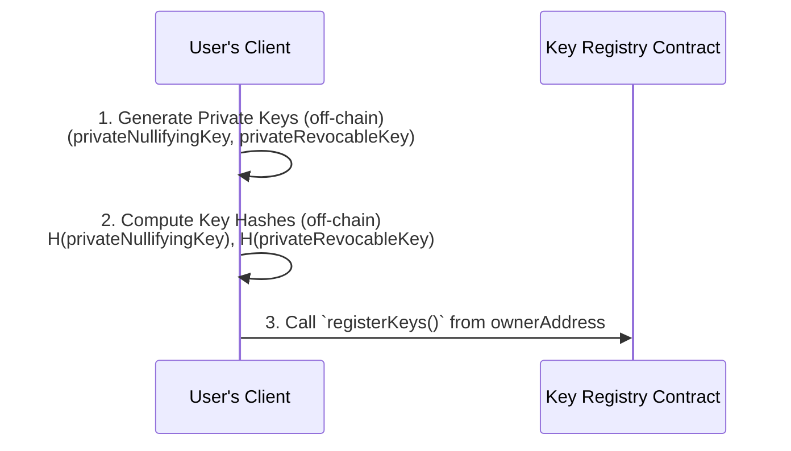
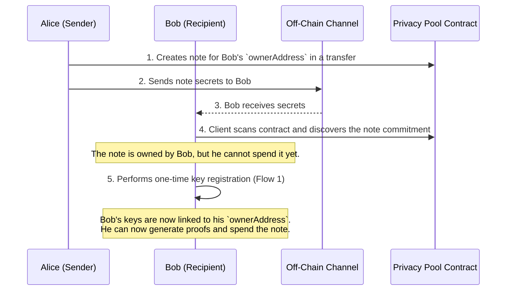
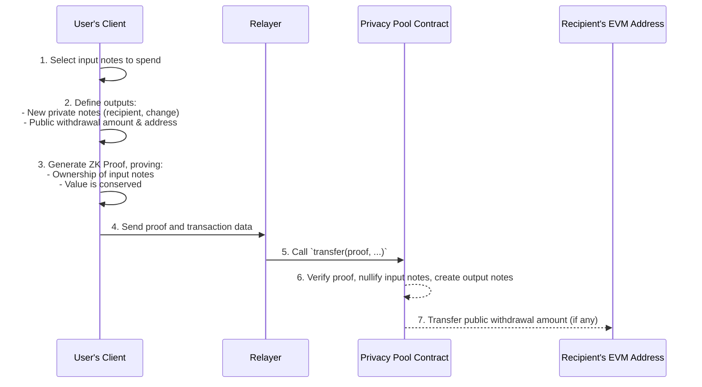
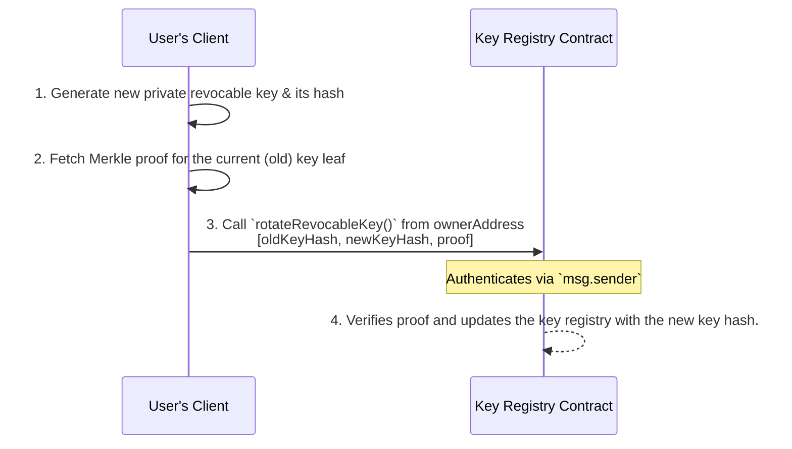

# System Invariants, Overview and Flows

## **1. Invariants**

This section outlines the core properties and design goals for the protocol.

### **1.1. Core Functional Properties**

1. **Private Withdrawals:** Users can withdraw funds from the pool to a public EVM address without creating an on-chain link between the withdrawal and the original deposit.
2. **Private Internal Transfers:** Within the privacy pool, users can transfer funds without revealing transaction details such as sender, recipient, amount, or asset.
3. **EVM Address Receipt:** Senders can send private payments using only the recipient's standard EVM address. Recipients do not need to perform any on-chain action before receiving funds, but will need to perform a one-time key registration to spend them.
4. **Splitting and Merging of Balance**: Balances can be split and merged, aligning with the standard operations of UTXO systems.
5. **Multi-Asset Support:** The protocol supports multiple ERC20 tokens within the same privacy pool contract.
6. **Efficient Proof Generation:** Zero-knowledge proofs can be generated efficiently on standard consumer hardware.

### **1.2. Security & Cryptographic Properties**

1. **Ownership:** Users have private keys that grant them exclusive control to spend their funds.
2. **Key Rotation:** Users can rotate their spending keys without losing access to their funds or compromising their privacy.
3. **Protocol Trustlessness:** The protocol itself cannot compromise user funds or private information.
4. **Uncensorable Balance Discovery:** Users can always discover and recover their private balance without relying on centralized third parties.

## **2. General**

### **2.1. System Overview**

The Privacy Pool v2 MVP operates as a UTXO-based privacy system on the EVM. Unlike account-based models, a user's balance is not a single number but a collection of discrete "notes”, akin to cash. Each note is recorded on-chain as a cryptographic commitment, which hides its details (value, asset type, owner).

To spend these notes, a user generates a zero-knowledge proof (ZK-SNARK) off-chain. This proof cryptographically demonstrates that the user owns the input notes and that the transaction is valid (e.g., no value is created from thin air), without revealing any private information. The protocol uses a nullifier system to prevent notes from being double-spent. This architecture allows users to merge and split notes, send them to other users, and withdraw funds back to the public domain, all while preserving privacy.

An important privacy feature of this design is the separation between the depositor (`msg.sender`) and the note owner. The `deposit` function allows any address to create a note for any other `ownerAddress`. This enables a simple form of private transfer: a user can call `deposit` to create a note owned by a different user, and then transmit the note's secrets off-chain. The public `Deposit` event will link the transaction to the depositor's address, but the cryptographic ownership of the new funds is privately held by the recipient.

### **2.2. Glossary**

- **Note:** A private representation of a user's funds, analogous to a UTXO. It contains details like the owner's address, the asset type, the value, and a unique secret.
- **Commitment:** The on-chain, public representation of a note. It is a cryptographic hash of the note's contents, which hides the underlying details.
- **Nullifier:** A unique value derived from a note's secret and a user's private key. It is published on-chain when a note is spent to prevent it from being used more than once (double-spending).
- **Key Registry:** An on-chain contract that links a user's public `ownerAddress` to hashes of their private spending keys, enabling authorization.
- **`ownerAddress`:** A standard Ethereum address that is designated as the owner of a note.
- **`noteSecret`:** A random, private value generated by the user to ensure each note commitment is unique.
- **`privateNullifyingKey`:** An immutable private key used to generate the nullifier for a note.
- **`privateRevocableKey`:** A private key used to authorize spending. This key can be rotated by the user if it is compromised.
- **Relayer:** An off-chain service that submits a user's transaction (and ZK proof) to the blockchain, helping to preserve the user's privacy by decoupling their IP address from their on-chain activity.

### **2.3. Key Architectural Concepts**

### **2.3.1. Note Commitment Construction**

A note's `commitment` is a cryptographic hash that acts as its on-chain identifier. It is constructed to hide the note's contents while allowing the owner to prove its existence and details within a ZK circuit.

1. **`noteAddressHash`**: `Poseidon(ownerAddress, noteSecret)` - This links the note to an owner and a unique secret, ensuring only the owner can reconstruct it.
2. **`commitment`**: `Poseidon(noteAddressHash, tokenId, value)` - The final hash that is stored in the on-chain Merkle tree.

The `noteSecret` is a critical piece of off-chain data generated by the note creator client. It provides the necessary entropy to ensure that each note commitment is unique, even if other parameters (owner, value, token) are identical. To spend a note, the user must provide the `noteSecret` as a private input to the ZK circuit. Therefore, the user's wallet software is responsible for securely storing this secret. Loss of the `noteSecret` will result in the permanent loss of access to the funds in the corresponding note.

A critical security requirement is that all signals representing a monetary value (`inputValues`, `outputValues`, `amountOut`) are constrained to a safe bit-length (e.g., 128 bits) *within the ZK circuit*. This is necessary to prevent value-creation attacks that exploit the modular arithmetic of the SNARK's prime field. While the contract checks the value of public deposits, the circuit is solely responsible for validating the values of private outputs.

### **2.3.2. Decoupling Note Ownership from Spending Authorization (Solving the "Cold Start" Problem)**

A significant usability hurdle in many privacy protocols is the "cold start" problem: sending funds to a user who has never interacted with the system. In protocols like Railgun, or the original Privacy Pools v1, a recipient must typically first generate a specific seed phrase to later derive secrets deterministically. This requires pre-emptive action from the recipient, creating friction and hindering adoption, as one cannot simply send a private payment to a standard Ethereum address (e.g., an ENS name).

The Privacy Pool v2 MVP solves this by decoupling note **ownership** from spending **authorization**.

- **Ownership is Implicit:** A note's ownership is cryptographically tied to the recipient's standard Ethereum address (`ownerAddress`), which is included in the note's commitment.
- **Authorization is Explicit:** To spend the note, the owner must explicitly authorize themselves by proving knowledge of a set of private spending keys. This is done via an on-chain `keyRegistry`.

This separation allows for a seamless onboarding flow:

1. A sender can create a note for any recipient's `ownerAddress` without requiring any prior action from the recipient.
2. The note's secrets (`noteSecret`) must be transmitted to the recipient via a secure off-chain channel.
3. The recipient discovers their note on-chain but cannot spend it yet.
4. The recipient calls `registerKeys()` from their `ownerAddress` **one time**. This links their address to hashes of their private spending keys (`privateNullifyingKey`, `privateRevocableKey`) in the on-chain `keyRegistry`.
5. This one-time registration retroactively authorizes the recipient to spend all current and future notes created for their `ownerAddress`.

The `keyRegistry` is a Merkle tree where each leaf is `Poseidon(Poseidon(ownerAddress), nullifyingKeyHash, revocableKeyHash)`.

### **2.3.3. Note Discovery and Dummy Note Uniqueness**

For a recipient to use a note, they must learn its private details (`value`, `tokenId`, `noteSecret`). In this MVP, this process is handled manually through a secure off-chain channel.

The sender is responsible for transmitting the note secrets to the recipient using a private communication method (e.g., Signal, Matrix). Once the recipient has the secrets, their wallet software can scan the on-chain commitment tree to find the corresponding note and add it to their private balance.

A more streamlined, on-chain announcement system using viewing keys to encrypt note details in public events is planned for the full v2 version of the protocol to improve the user experience.

**A Note on Dummy Output Notes:** The protocol requires that every transaction produces two new output commitments. In cases where only one new note is needed (e.g., a 1-input-1-output transfer), the second is a zero-value "dummy" note. It is a critical client-side responsibility to ensure the `addressHash` for this dummy note is unique for every transaction to prevent failures. The client should generate this `addressHash` as a fresh, random field element. This approach ensures uniqueness while intentionally creating an **unspendable** note, as there are no known pre-images (`ownerAddress`, `noteSecret`) for the random hash. This simplifies client logic by avoiding the need to manage secrets for valueless notes.

### **2.3.4. Relayer for Transaction Submission**

To preserve the privacy of the sender, all `transact` calls are intended to be submitted to the blockchain via a third-party relayer. When a user submits a transaction directly, their IP address is linked to their on-chain activity, which can compromise their privacy. By using a relayer, the user sends the transaction data and ZK proof to an off-chain service, which then broadcasts it to the network. The relayer pays the gas fee, and the on-chain transaction originates from the relayer's address, breaking the link to the user.

For the purposes of the MVP, the relayer model will be simplified. It is assumed that an **altruistic relayer** will be available to process transactions. This means the relayer will not charge a fee for its service, either publicly or through receiving a private note as part of the transaction. More complex, incentivized relayer models are a consideration for future versions of the protocol.

### **2.4. Core User Flows**

### **2.4.1. One-Time Key Registration**

This is the initial setup for a user to interact with the protocol. It is required for spending funds but not for receiving them.

### **2.4.2. Receiving a First Private Transfer (Cold Start)**

This flow details how a new user (Bob) can receive funds using only his public `ownerAddress`, solving the "cold start" onboarding problem.

### **2.4.3. Transfer and Withdrawal**

This is the core transaction flow. A user generates a single ZK proof to spend their existing notes. This transaction can create new private notes (for a recipient and/or change) and optionally withdraw funds to a public address.

### **2.4.4. Key Rotation**

If a user's spending key (`privateRevocableKey`) is compromised, they can rotate it without losing their funds.

