# Kohaku Tech Design

## **Background**

Current transaction infrastructure on Ethereum exposes account activity in a fully transparent manner, creating strong linkability across user actions. While privacy preserving systems exist, they often require users to leave their primary wallet environment, interact with specialized dApps, and manage separate interfaces. This fragmented flow discourages usage, even among users who value privacy.

Privacy Pools v2 address these limitations by enabling private transfers within a shared pool, allowing value to circulate while maintaining anonymity across multiple interactions. Importantly, they decouple recipient key registration from asset custody, allowing any EVM address to receive privately without prior setup solving the cold-start problem that has hindered adoption of earlier approaches.

Kohaku builds Privacy Pools directly into the wallet, so private transfers work like normal ones, no extra apps, no extra setup.

# **General**

The protocol uses a note-based architecture where each payment creates a commitment bound to the recipient’s address hash (`Poseidon(ownerAddress, noteSecret)`). This hides the recipient’s identity on-chain while ensuring only they can spend the funds.

While the underlying protocol supports advanced features like key rotation and encrypted note onchain discovery, Kohaku’s interface prioritizes core functionality: deposits, transfers, payment requests, and note management.

A new, dedicated `PrivacyPoolsController` is introduced into core business logic. Managing the lifecycle of private accounts, handling generation of ZK Proofs, and orchestrating the creation and management of notes with their corresponding secrets.

Kohaku’s home dashboard lists assets alongside the protocol they belong to. Selecting an asset opens a dedicated view showing the actions supported by that protocol. For Privacy Pools, the available features are: `Deposit`, `Transfer`, `Payment Request`, and `Import Secret Notes`.

## **Requirements**

1. **The user should access private transactions through the same interface as public transactions**, with privacy flows embeded as native wallet functionality.
2. **Privacy keys should be derived deterministically from EIP-712 signatures using a dedicated address from a custom BIP-44 path**, eliminating additional seed storage while preventing phishing attacks through privileged wallet access that dApps cannot replicate.
3. **Any EVM address should receive private payments immediately without prior registration**, solving the cold start problem through decoupled key registry that separates spending authorization from note ownership.
4. **Private transfers should execute transactions posting only commitment hashes on-chain**, maintaining full sender and recipient anonymity while supporting within-pool transfers without exposing any note data.
5. **Notes should automatically merge into single balance notes per asset**, preventing fragmentation while maintaining transaction history with nullified status tracking for optimal privacy and user experience.
6. **Payment requests should use addressHash URIs (`cspr://`) containing `Poseidon(ownerAddress, noteSecret)`**, hiding recipient real addresses while enabling automatic payment tracking.
7. **Secret notes should be shared through off-chain channels as the primary discovery mechanism**, with the wallet providing easy copy functionality for completed transfers and imported note validation.
8. **ZK proof generation should be abstracted behind standard wallet operations**, with the SDK providing simple interfaces like `generateTransactProof(inputNotes, outputNotes, withdrawAmount?)` while handling circuit complexity internally.
9. **Local storage should maintain encrypted note data using wallet-derived keys**, synchronizing merkle tree state and root history while managing user balance notes, recipient notes, and transaction history securely.
10. **Privacy relayers should preserve sender anonymity through transaction submission**, while supporting self-relay capabilities for advanced users.
11. **Revocable keys should support rotation while preserving nullifying key identity**, enabling security recovery from key compromise without losing access to existing funds or requiring migration.

# **In-Depth**

This section details the technical implementation of the Privacy Pools integration, focusing on the new `PrivacyPoolsController` and the execution of the core user flows.

## **User Flow Implementation**

### App Secret Generation and Registration

The implementation details of the `deriveAppSecret` function follow this step-by-step guide:

[Signature-Based Derivation Implementation Guide](RandomnessGuide.md)

[Deterministic secret generation from a signature](SecretGeneration.md) 

**Secret Generation**

The app secret derivation uses a deterministic signature-based approach leveraging EIP-712 structured data signing. The wallet generates an ephemeral root secret from the ECDSA signature’s r-value on a domain-separated message containing the dedicated address. This root secret undergoes HKDF expansion with the app identifier as salt to produce the final app secret. The process ensures deterministic key derivation while maintaining signature uniqueness through the address binding from a specific derivation path, this address is not meant to be exposed nor can be generated by dApps preventing phishing attacks.

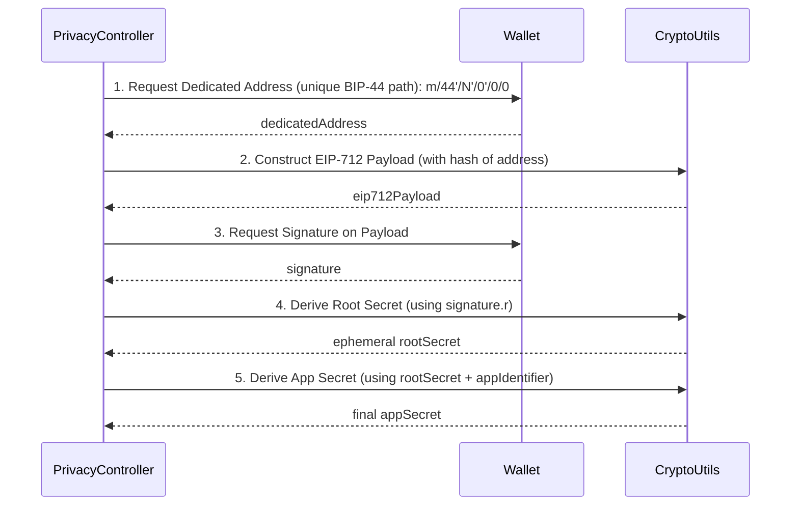

Generating `nullifyingKey`, `revocableKey` , `viewingPrivateKey`:

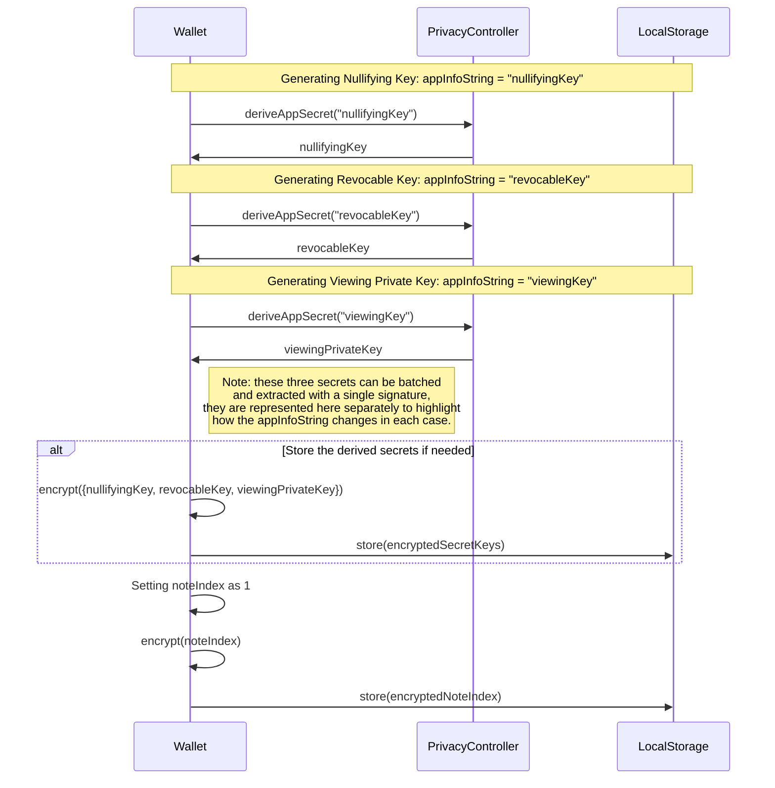

For the registration of these secret keys, they are generated on-demand using the signature-based derivation.

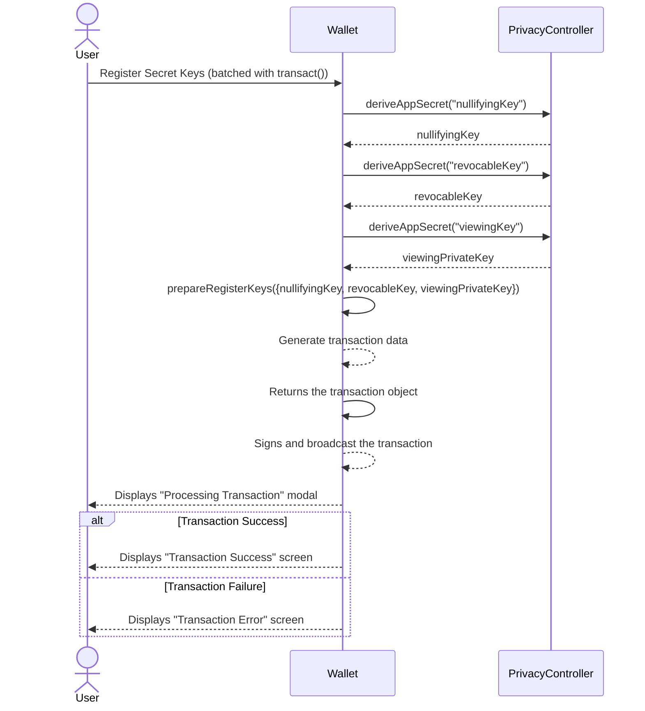

**Note:** The registration of the secret keys will be batched automatically with the user’s first transfer. This is a one-time registry that is required, which can be then be checked on-chain through `mapping(address => uint256) public keyLeafIndices;`.

### Contract interaction

A public transaction calls the `Keystore.sol` contract method:

`registerKeys(uint256 _revocableKeyHash, uint256 _nullifyingKeyHash)`

This computes a merkle leaf as:

`PoseidonHash(addressHash, revocableKeyHash, nullifyingKeyHash)` where `addressHash = hash(msg.sender)`.

Another public transaction call is made to `Keystore.sol` through

`registerViewingKeys(bytes32 _viewingKey)`to store the `viewingPublicKey` in a mapping, enabling later announcements of notes encrypted with the corresponding `viewingPublicKey`.

`viewingPublicKey = viewingPrivateKey * G`

The contract exposes:

`mapping(address => uint256) public keyLeafIndices;`

`mapping(address => bytes32) public viewingKeys;`

These allow anyone to check whether an address has already registered.

### **Deposit Flow**

The deposit flow moves funds from the user’s public EOA into the Privacy Pool.

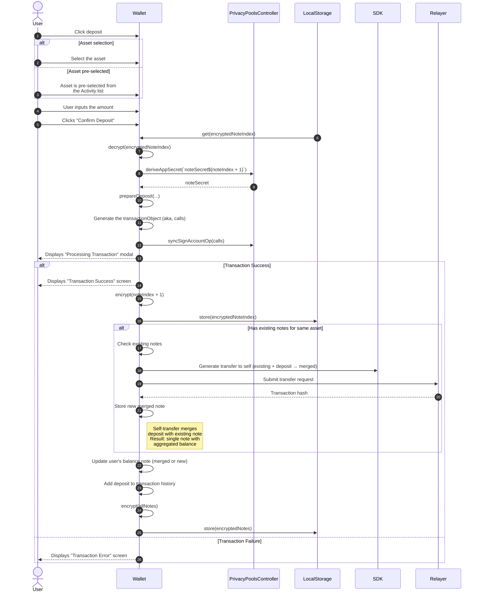

At a higher level, the user follows this flow:

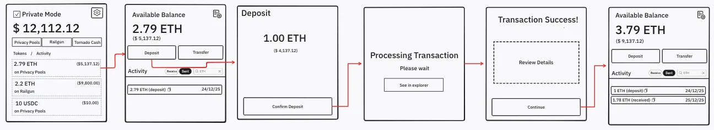

### Contract interaction

A public transaction calls `Pool.sol` contract method: `function deposit(address _asset, uint256 _value, uint256 _addressHash)`

- `addressHash = Poseidon(ownerAddress, noteSecret)` → This enables direct deposits to recipients without revealing their real addresses. Alice can transfer to Bob by depositing to his addressHash, eliminating the deposit-then-transfer step while preserving Bob’s address privacy through cryptographic commitment.

### **Transfer Flow**

The transfer flow is bifurcated. The user can either perform a private transfer (staying within the pool) or a private withdrawal (exiting the pool). The UI presents this as a checkbox, with private transfers as the default option following private by default Kohaku vision.

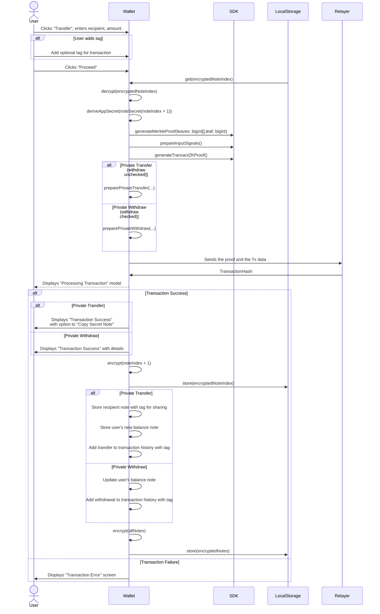

where:

```tsx
const noteSecret = (index: number) => `noteSecret${index}`
```

**Private Transfer within Pool**

Uses the sender’s single balance note as input and creates two outputs: a note for the recipient (stored for sharing) and the sender’s new balance note with remaining funds. The transfer amount and recipient details are saved in transaction history.

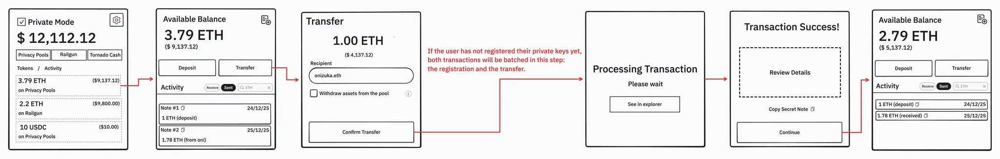

**Private Withdraw from Pool**

This sends funds directly to a public address. The user’s balance note is updated, and the transaction is recorded in the history for activity display.

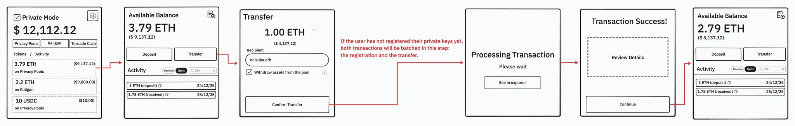

### Circuit Interaction

Privacy Pools SDK method call to:

```tsx
sdk.generateTransactProof(keys: Key[], inputNotes: Note[], outputNotes: Note[], withdrawAmount?: bigint): Promise<TransactionProof>

transferssdk.prepareTransferNotes(fromNotes: Note[], toAddress: string, amount: bigint): Promise<{input: Note[], output: Note[]}>
```

All merkle proof generation, circuit interactions, and cryptographic operations are handled internally by the SDK. 

### Relayer Interaction

For private transactions, the wallet submits ZK proofs to a privacy relayer via `POST` request. The relayer receives proofs and transaction data, introducing third-party trust assumptions for users prioritizing maximum sovereignty. The relayer operates altruistically for MVP demonstration purposes.

Advanced users can bypass relayers entirely through the protocol’s permissionless `transact()` function which enables direct transaction submission, eliminating third-party dependencies and IP exposure. Self-relay requires users to manage anonymity preservation independently, including gas funding through separate addresses, transaction timing randomization, and avoiding aggregation patterns that could compromise privacy.

`POST /relayer/request`

`{ transfer: {procesor, data}, proof, scope, chainId }: RelayRequestBody`

### Contract Interaction through Relayer

```solidity
function transact(ProofLib.Proof calldata _proof, address _asset, address _recipient, bytes[2] calldata _ciphers)
```

### Sharing Secret Notes

While users maintain one aggregated note per asset for their own balance, all recipient notes created during private transfers are stored separately for sharing purposes.

The user will have two ways to share the secret notes of completed private transfers:

After completing a private transfer, once the transaction has been successfully sent, the confirmation modal will allow the user to copy the secret note and share it with the recipient.

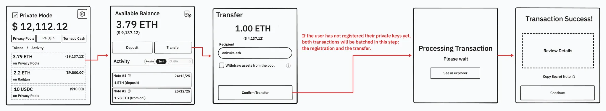

If the user wants to view or share secret notes from past private transfers, they can access them through the Activity section by navigating to the details of the deposited token in Privacy Pools.

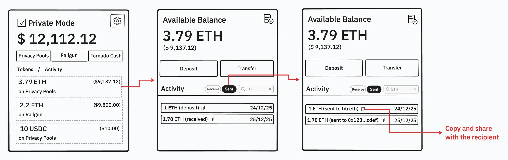

The following diagram describes how notes will be managed internally:

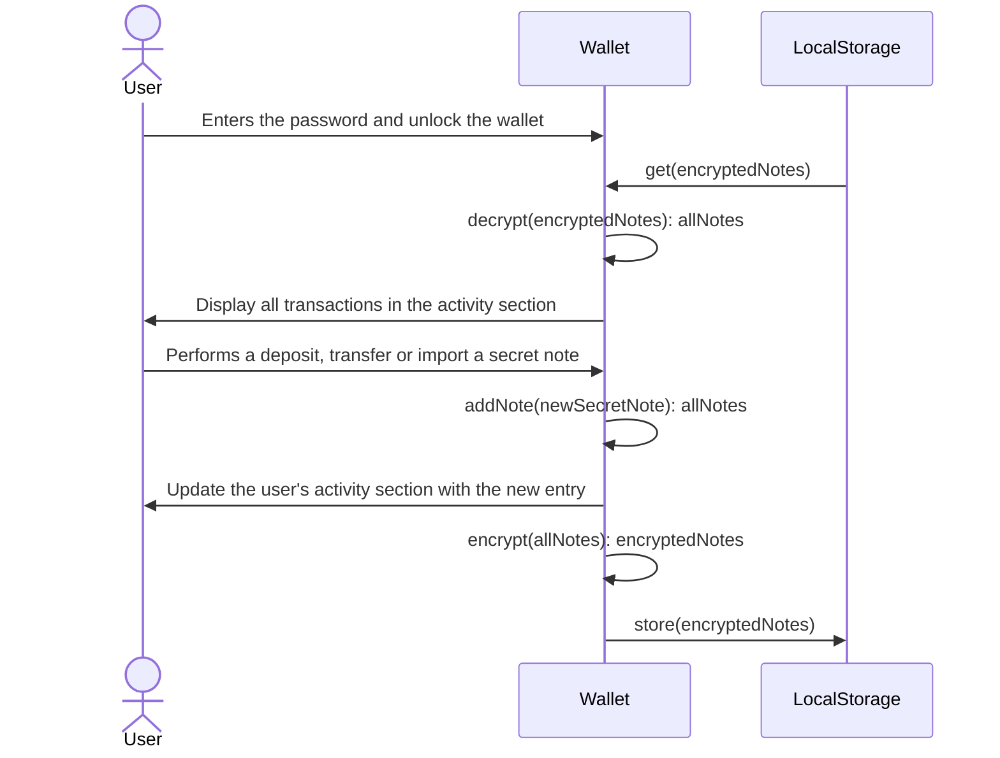

- The `allNotes` object contains:
    - **User’s balance notes**: One aggregated note per asset (automatically merged)
    - **Recipient notes**: Notes created for others during transfers (kept for sharing)
    - **Transaction history**: Individual transfer amounts and details for activity display

All note data is encrypted using wallet-derived keys and stored locally, following established security patterns for sensitive wallet data.

### Importing Secret Notes

Shows how users import payment notes to increase their wallet balance. Notes are encrypted and stored locally in the browser extension for security.

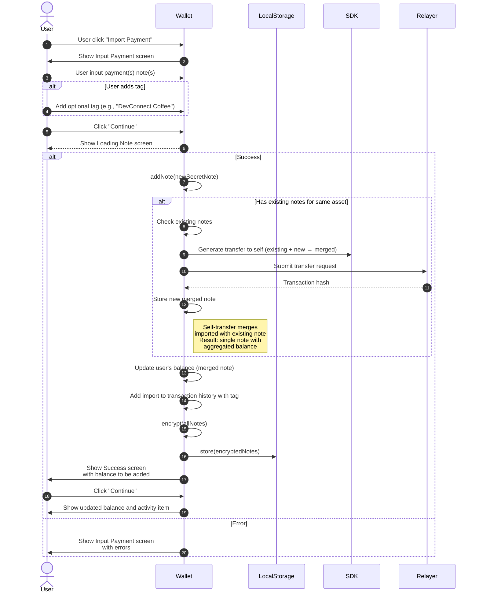

At a higher level, the user follows this flow:


### Automatic Note Merging

To prevent note fragmentation and improve user experience, the wallet implements automatic note merging:

### **Technical Implementation**

The circuit supports a 2:2 transaction scheme that enables merging:

- **Input**: Two notes owned by the same address
- **Output**: One consolidated note with the combined value + one zero-value dummy note

**Note**: Since users maintain one note per asset, external transfers use this single note as input (1:2 circuit scheme). The outputs are: the recipient’s note (stored for sharing) and the user’s new balance note (remaining funds).

### **Automatic Merge Triggers**

1. **During Note Import**
    - When importing a note and the user already has a note for that asset, the system automatically merges them into a single note
    - For multiple imports: Notes are batched with precomputed merkle tree indices, submitted as a single multicall transaction via relayer
2. **During Deposits**
    - If a user already has a note for the asset being deposited, the new deposit automatically merges with the existing note
    - This maintains the one-note-per-asset rule for optimal privacy and efficiency

### **Merge Flow**

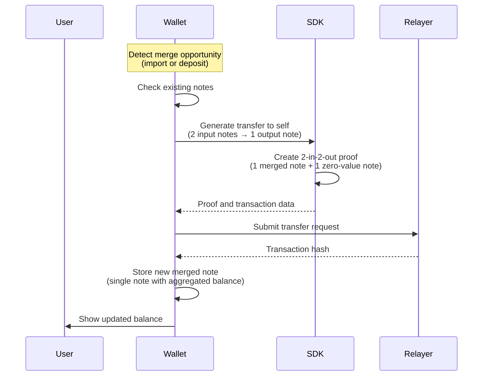

## Note Management

### Balance Management

With automatic merging, users maintain only one note per asset for their balance:

- **For transfers/withdrawals**: The single balance note is used as input
- **Balance update**: After a transfer, the user receives a new balance note with remaining funds
- **No complex selection needed**: The one-note-per-asset model eliminates fragmentation

### Transaction History & Recipient Notes

While the user’s balance is consolidated, the system maintains:

- **Full transaction history**: Every deposit, transfer, and import with amounts
- **Recipient notes**: All notes created for others are stored for sharing/resending
- **Activity display**: Users can see individual transaction amounts in their activity feed
- **User tags**: Custom labels for identifying transactions, especially useful for payment requests
- **Nullifier status**: Tracks whether notes have been spent or merged

## Payment Request Flow

Privacy-preserving payment request using `addressHash = Poseidon(recipientAddress, noteSecret)` shared via URI. Payer deposits directly to addressHash, creating a note only the requester can spend without exposing recipient address.

**URI Format (ERC-7856 + ERC-7828):**

```
cspr://<address-hash>@<chain-id>/<amount>/<token-address>?requestId=<id>
```

**Example:**

```
cspr://0x7f3e9a4b...@11155111/1000000000000000000/native?requestId=550e8400
```

The wallet provides dedicated interfaces for payment request generation and fulfillment, handling URI encoding/decoding and automatic transaction crafting with addressHash resolution.

## Feature Flag - Privacy Pools versioning control

A feature flag controls access between Privacy Pools V1 and V2 implementations. V1 implementation serves as an experimental spike for wallet integration testing and ZK proof validation (it is not production-ready and was implemented solely for technical validation purposes). V2 represents the full production implementation targeting DevConnect, delivering one-click private send and receive capabilities with seamless UX integration.

Implementation requires adding `privacyPoolsV2` to FeatureFlags constants in `featureFlags.ts` and toggling via `featureFlags.isFeatureEnabled('privacyPoolsV2')`.

## Scope

**Core Requirements**
- Private send functionality
- Private receive functionality

**Nice to Have (Future Implementation)**
- Payment request generation
- Self relayer capabilities
- On-chain encrypted note announcements
- Revocable key rotation

*Note: If development time permits, nice-to-have features will be tackled in the order listed above.*
