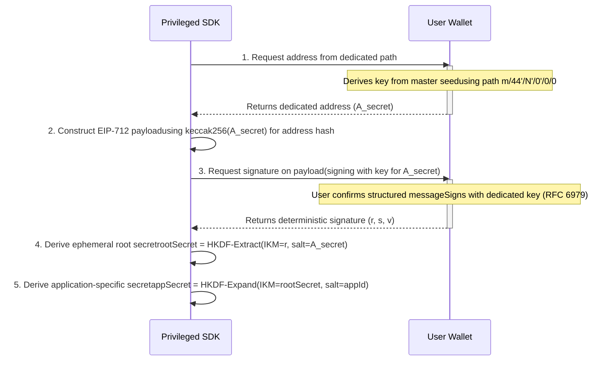
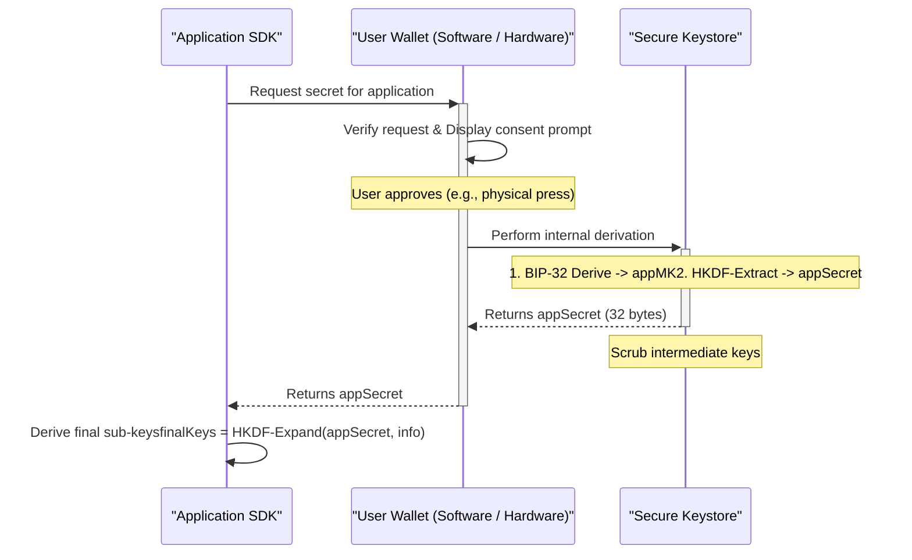
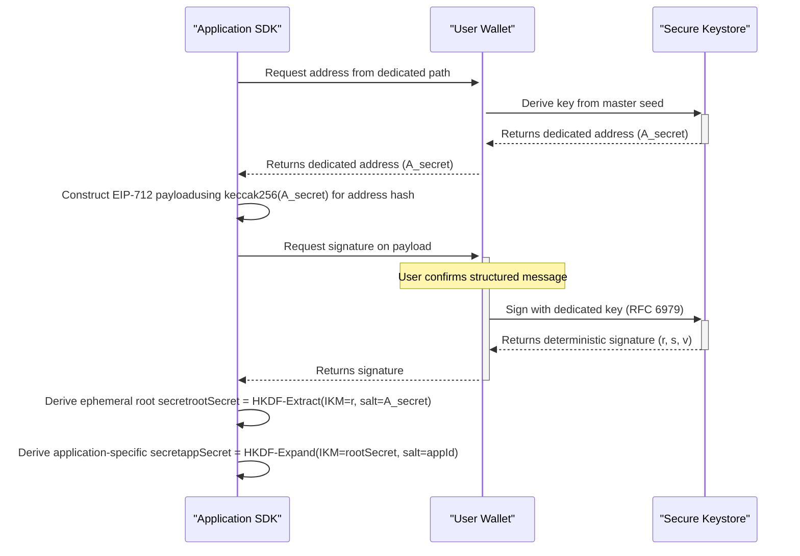

# Deterministic secret generation from a signature

## Problem Statement

Many applications, particularly those focused on user privacy, require cryptographic secrets to function. The conventional approach of forcing users to generate, manage, and back up a new master seed for each application is unsustainable. This "seed fatigue" leads to poor user experiences and significant security risks, as users might resort to insecure practices like password reuse or storing mnemonics in plaintext.

A clear solution is to derive all application-specific secrets from the user's single, primary master seed already present in their wallet. However, naive implementations of this concept are dangerously insecure. Simply signing a static message, for example, can expose users to phishing, replay attacks, and other vulnerabilities that could compromise their application data and privacy.

This document outlines the fundamental properties that any robust protocol for secret derivation from the user master seed must satisfy. It defines the guarantees users must have, the security model that must protect them, and the features developers need to build a secure and interoperable ecosystem.

---

**I. User-Facing Guarantees**

These properties define the protocol's contract with the user, focusing on usability, control, and clarity.

1. **A Secure Foundation:** The protocol provides a secure and standardized way to derive application secrets from the user's single master seed. This serves as a reliable foundation, giving users the option to manage their digital identity from one safe place and freeing them from the burden of handling new mnemonics for each application.
2. **Full, Deterministic Recoverability:** Users must be able to regenerate their application-specific secrets on any device using only their master seed. This is possible because the derivation is a pure, deterministic function of the seed and the application's identifier. The process must not rely on any external state, network connection, or third-party service, ensuring it is repeatable anywhere, anytime, and completely self-sovereign.
3. **Informed and Unambiguous Consent:** Before a secret is derived, the user must give explicit, intentional approval. The consent prompt must be unambiguous, clearly identifying the requesting application and explaining that the action generates a key, not a transaction.
4. **Controlled Compartmentalization:** The protocol should allow users to generate multiple, independent secrets for a single application from their master seed. This enables users to "rotate" which secret they are actively using, effectively compartmentalizing their activity. All previously generated secrets remain fully recoverable, ensuring that users never lose access to historical data or assets, while giving them control to use fresh identities for new interactions.

**II. Security Guarantees**

These properties define the core security model of the protocol, ensuring that user assets and data are protected.

1. **Strict Seed Containment:** The user's master seed must remain strictly within its secure storage environment (e.g., a hardware wallet's secure element or a software wallet's encrypted keystore). It must never be exported, passed to another process, or handled in memory outside of this hardened cryptographic boundary. All operations that require the seed must be performed *inside* this secure environment.
2. **Seed Isolation:** The derivation path from the master seed to an application secret must be a one-way street. The protocol must guarantee that a compromised application secret cannot be used to reverse-engineer the master seed or any other secrets derived from it. This ensures that even if an application's security is breached, the user's primary on-chain assets remain secure because the keys controlling them are isolated.
3. **Cross-Application Isolation:** Secrets derived for different applications must be cryptographically independent. A compromise of Application A's secret must not reveal any information about Application B's secret or the master derivation root.
4. **Phishing and Forgery Resistance:** The protocol must be secure against phishing attacks, where a malicious entity attempts to trick a user into generating a secret for it. The process must bind the derived secret to a specific application identity in a way that an attacker cannot forge.

**III. Ecosystem and Developer Guarantees**

These properties ensure the protocol is a reliable and practical foundation for developers to build upon.

1. **Interoperability:** The derivation method must be clearly and publicly specified to ensure different wallets and applications can implement it consistently. This prevents ecosystem fragmentation, where each wallet or application creates its own incompatible and likely insecure method, improving security for all users.
2. **A Simple, Extensible Primitive:** The protocol must be defined as a minimalist primitive that does one thing: derive a single, high-entropy root secret for an application. This simplicity makes the core logic easier to audit and secure. By providing a root secret rather than final-use keys, the protocol is inherently extensible, allowing applications to build their own complex cryptographic schemes on top of this simple, trusted foundation.
3. **Forward Compatibility:** The protocol definition must include a clear versioning system. This ensures that protocol upgrades can be introduced over time without creating security vulnerabilities (such as cross-version replay attacks) between implementations.

---

# Signature based derivation - Overview

This document provides a condensed overview of the protocol for deriving application-specific secrets from a user's master seed via a single signature.

## 1. Introduction

This protocol enables the derivation of application-specific secrets from a user's master seed using a single, deterministic signature.

Its security is founded on an **information asymmetry**: it leverages capabilities available to a privileged wallet context that are intentionally inaccessible to a standard, sandboxed dApp. This is designed to mitigate phishing attacks while working with standard EIP-1193 wallets, without requiring direct access to the user's master seed.

## 2. Protocol Flow

The process involves a privileged context (like a wallet's browser extension) that communicates with the **wallet's secure keystore**—the protected environment where the user's master seed lives. This can be a software-based vault or a connected hardware wallet.

## 3. How It Works: Core Concepts

The protocol's security rests on a three-stage process to safely extract an application-specific secret.

**3.1. The Cryptographic Challenge**

To prevent phishing, the user must sign a message that a malicious dApp cannot create.

- **The Asymmetrically-Derived Address:** The process begins by deriving a special-purpose address (`A_secret`) from a unique BIP-44 path. A privileged context (like a wallet extension) can do this, but a sandboxed dApp website **cannot**—the standard wallet API (`window.ethereum`) provides no method for it.
- **The Unique Payload:** This asymmetrically-derived `A_secret` is used to create a unique **address hash** (`keccak256(A_secret)`) inside a human-readable EIP-712 message. Because a phishing site cannot learn `A_secret`, it cannot construct a valid payload. This is the protocol's first layer of defense; security is further maintained by the wallet's standard permission model, which prevents sites from requesting signatures from accounts they have not been explicitly connected to.

**3.2. The Deterministic Signature**

The signature itself serves as both a proof of ownership and the source of entropy.

- **Self-Referential Proof:** The user signs the message using the private key corresponding to `A_secret`. This creates a self-contained cryptographic proof that the signer possesses the master seed from which `A_secret` was derived.
- **Deterministic Entropy:** The signature is generated according to **RFC 6979**, which makes it deterministic (it will always be the same for the same user and message, as the nonce is a deterministic function of the **private key and the message hash**). The signature's `r` value provides 256 bits of high-entropy randomness that is used as the raw material for the secret. In total, the signature serves three functions: it proves control of the master seed, provides entropy for key derivation, and binds the user's identity to the derived secret.

**3.3. Two-Stage Key Derivation**

To ensure security and isolation, the protocol uses the standard **HKDF (RFC 5869)** to refine the entropy from the signature in two distinct stages. This two-stage design enables a "Sign-Once-Per-Session" model, where a single signature can authorize the derivation of secrets for multiple applications.

- **Stage 1: Create a Root Secret.** An ephemeral `rootSecret` is created by combining the signature's entropy (`r` value) with the key's unique identity (`A_secret`). This secret is a temporary value that **must never** leave the secure context where it is generated.
- **Stage 2: Create the Application Secret.** The final `appSecret` is derived from the `rootSecret` using a unique application identifier (e.g., `"com.example.myapp"`) as a salt. This step ensures each application receives its own unique, cryptographically isolated secret. This is the only value that should be exposed to the application's less-privileged code.

## 4. Security Summary

The protocol is designed to uphold the following core security properties:

- **Strict Seed Containment:** The entire process is executed without the master seed ever leaving the wallet's secure keystore.
- **Seed Isolation:** The use of BIP-44 hardened derivation and a KDF ensures that the final `appSecret` cannot be used to reverse-engineer the master seed.
- **Cross-Application Isolation:** The second stage of the HKDF, which salts the derivation with a unique application identifier, ensures that a compromise of one application's secret does not affect any other.
- **Phishing and Forgery Resistance:** This is achieved through the cryptographic challenge, where a payload is constructed using an asymmetrically-derived address that a sandboxed dApp cannot generate.

## 5. Applications

The generated `appSecret` is a high-entropy root of trust that applications can use to derive their own internal key hierarchies. This is ideal for privacy-preserving protocols that need client-side secrets, as it allows them to onboard users without requiring them to manage a new, application-specific seed phrase. The underlying BIP-44 path structure also allows for key rotation and multi-profile support by incrementing the account index in the derivation path.

---

# Hardware-Native derivation - Overview

This document provides a condensed overview of the protocol for deriving application-specific secrets directly within a hardware wallet's secure enclave.

## 1. Introduction

This protocol specifies a hardware wallet firmware function, `derive_app_secret`, that derives application-specific secrets from a user's master seed. The entire operation executes atomically within the hardware's secure enclave, eliminating the need for a signature ceremony and providing a standardized, hardware-native primitive for secret derivation.

The protocol defines a clear separation of concerns, where the firmware performs the core cryptographic operation, while the host wallet software is responsible for vetting application requests.

## 2. Protocol Flow

The protocol consists of a single function call from a host application, through a host wallet, to the hardware device.

## 3. How It Works: Core Concepts

The protocol's design is centered on security through minimalism and a strict separation of duties.

**3.1. A Minimalist Firmware Primitive**

The function performed by the hardware is deliberately simple to minimize the attack surface and facilitate auditing.

- **Direct Hardware Derivation:** The firmware uses its native BIP-32 implementation to derive an intermediate private key (`appMK`) from a specified path. This path **must** use hardened indices to ensure cryptographic isolation between different application secrets.
- **Finalization:** This intermediate key is immediately passed to an HKDF-Extract function, which uses a protocol-specific salt to produce the final `appSecret`. The `appMK` never leaves the secure enclave and is zeroized from memory after use.
- **Extensibility for Application Flexibility:** The protocol only performs the `Extract` part of HKDF. The application receiving the `appSecret` is responsible for using the `Expand` part of HKDF to derive any sub-keys it needs. This keeps the firmware's role simple, minimizing the hardware attack surface and ensuring that applications can evolve their own key hierarchies without requiring slow, coordinated firmware updates.

**3.2. Separation of Concerns & Phishing Mitigation**

Unlike the signature method, which relies on a cryptographic challenge, the enclave method relies on a procedural separation of concerns to mitigate phishing.

- **Firmware (Cryptographic Core):** The hardware's role is to perform the derivation correctly and display accurate information on its trusted screen.
- **Host Wallet (Phishing Defense):** The software wallet (e.g., browser extension) is responsible for request validation, ensuring that a malicious application cannot request a secret for a legitimate one.
- **Physical User Consent:** Every derivation requires explicit physical confirmation on the device. By displaying the application name and derivation path, the hardware provides the user with a final opportunity for informed consent, preventing unintended key derivation.

## 4. Security Summary

The protocol is designed to uphold the following core security properties:

- **Strict Seed Containment:** All operations involving the master seed are performed entirely within the hardware wallet's secure enclave.
- **Seed Isolation:** The use of BIP-32 hardened derivation ensures the `appSecret` cannot be used to reverse-engineer the master seed.
- **Cross-Application Isolation:** The use of unique, hardened BIP-44 derivation paths for each application ensures that a compromise of one secret does not affect any other.
- **Phishing and Forgery Resistance:** This is achieved by the host wallet, which must validate requests, and by requiring physical user consent on a trusted display for every derivation.

## 5. Applications

The derived `appSecret` serves as a high-entropy root of trust for any application-specific cryptography. This allows protocols to hook into the user's primary hardware-secured seed without requiring users to manage new mnemonics, simplifying the user onboarding process for privacy systems, encrypted data storage applications, and decentralized identity solutions.

---

# Comparison

## 1. Introduction

Many applications, particularly those focused on privacy, require client-side cryptographic secrets. To provide a good user experience, these secrets should be derived deterministically from the user's single master seed, avoiding the need for users to manage new mnemonics.

Two primary approaches are proposed to solve this problem. They are differentiated by a single, critical assumption: **whether or not hardware wallet firmware can be modified.**

1. **The Signature-Based Approach:** A pragmatic proposal designed to work with the existing ecosystem *today*.
2. **The Hardware-Native Approach:** A proposal for a new standard that represents a more direct and efficient *ideal* solution for the future.

This document provides an overview of both proposals, followed by a comparison of their respective advantages and disadvantages.

---

## 2. Approach 1: Signature-Based Derivation

This approach is designed to work with today's hardware and software wallets without requiring firmware updates. It uses a carefully crafted EIP-712 signature ceremony to derive entropy from the user's seed.

**Overview**

This approach uses a carefully constructed EIP-712 signature as a source of entropy. It is designed to work with existing wallets without requiring firmware modifications. Its phishing resistance is founded on an information asymmetry, where a privileged SDK can access information that a sandboxed dApp cannot.

**Protocol Flow**

## 3. Approach 2: In-Wallet Derivation

**Overview**

This approach specifies a dedicated function, `derive_app_secret`, to be implemented directly inside a wallet's secure keystore. It represents a more secure and efficient long-term solution. The entire operation executes atomically within this secure boundary, eliminating the need for a signature ceremony. Its phishing resistance relies on a procedural separation of concerns, where the wallet software validates requests before the keystore performs the derivation.

**Protocol Flow**

## 4. Head-to-Head Comparison

To better illustrate the trade-offs, here is a direct comparison of the two approaches across several key criteria.

| Criterion | Signature-Based Derivation | In-Wallet Derivation |
| --- | --- | --- |
| **Compatibility** | **Works today.** Compatible with any wallet that supports custom path derivation and RFC 6979 signatures. | **Requires future adoption.** The `derive_app_secret` function must be implemented by wallet developers. |
| **User Experience (UX)** | **Higher friction.** Requires a full signature ceremony. The "Sign-Once-Per-Session" model mitigates this for subsequent derivations. | **Lower friction.** Requires a single, simpler approval prompt from the wallet for each derivation. |
| **Phishing Mitigation** | **Cryptographic.** Relies on the information asymmetry of the derived address to create a challenge a dApp cannot construct. | **Procedural.** Relies on the wallet software to act as a gatekeeper, validating requests and securing user consent. |
| **Core Dependency** | **RFC 6979.** Determinism is critically dependent on the wallet's correct implementation of deterministic nonces. | **BIP-32.** Relies on the wallet's standard, hardened key derivation function. |
| **Logic Location** | **Primarily in the SDK.** The SDK is responsible for deriving the address, constructing the payload, and performing the two-stage KDF. | **Primarily in the Wallet.** The wallet performs the core BIP-32 and HKDF-Extract operations; the SDK only performs the final HKDF-Expand. |
| **Intermediate Value Exposure** | **Higher.** The derived address (`A_secret`) and the signature's `r` value are handled by the SDK in the host environment. | **Lower.** The intermediate key (`appMK`) never leaves the secure keystore. Only the `appSecret` is returned. |

## 5. Conclusion and Recommendation

Both proposals aim to solve the core problem of deriving application-specific secrets from a master seed. The choice between them is a matter of strategy and timeline.

- The **Signature-Based Approach** is a pragmatic proposal for the **present**. It is designed as a method that could be implemented today with the tools and infrastructure that already exist.
- The **In-Wallet Approach** is proposed as an ideal standard for the **future**. It offers a potentially superior user experience and a simpler cryptographic design. The ecosystem (application developers, wallet providers, and users) could advocate for wallet developers to adopt such a standard to provide a better foundation for security and usability in the long term.

The recommended path forward is to **propose both in parallel**: refining the signature-based proposal for immediate needs while collaborating as an ecosystem to get a hardware-native standard adopted for a more secure and user-friendly future.